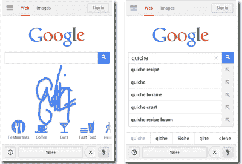

# 数字原住民和医生欢欣鼓舞，谷歌手写变得更快更智能 

> 原文：<https://web.archive.org/web/https://techcrunch.com/2013/01/18/digital-natives-and-doctors-rejoice-google-handwrite-gets-faster-and-smarter/>

# 数字原住民和医生欢欣鼓舞，谷歌手写变得更快更智能

谷歌手写功能是搜索团队去年推出的一个小而有用的工具，今天得到了一点 T2 的升级。当你在移动设备上“写”你的搜索时，这个工具允许你打开一个模式。

更新的一部分是谷歌手写识别重叠字符的能力，如果你选择搜索语言，可以一次写多个汉字。从你设备上的谷歌移动搜索页面，进入设置，启用“手写”模式，试试看。如果你有潦草的笔迹，那么你会非常高兴地了解更多的更新。

以下是谷歌产品经理劳伦斯·张对今天的变化的看法:

> 如果您以前尝试过手写，您可能会在输入小写字母“L”、数字“1”或大写字母“I”时遇到一些问题。现在，我们为你的角色提供了不同的解释，你可以在空格键上选择。同样，在日语中，字符“イ”和“ィ”看起来几乎相同，但它们是不同的字符，产生不同的搜索结果。如果谷歌以一种方式解释你的笔迹，而你的意思是另一种方式，你现在可以更容易地做出更正。

虽然这个工具看起来没什么大不了的，但它背后的技术相当复杂，尤其是上面提到的对数百万潜在用户的手写的理解。我们写东西的方式不尽相同，有些人的书写比其他人更糟糕。咳咳。至于重叠字母，Chang 解释了 Google 如何深入解决这些问题:

> 与平板电脑相比，手机屏幕更小，在上面写字有点困难。现在，你可以一个字母一个字母地写，而不是把你的字母挤过小屏幕的宽度。假设你在杂货店，你想在手机上查找乳蛋饼的食谱。当你写字母“q”、“u”、“I”、“c”、“h”和“e”时，如果它们重叠和有点混乱也没关系。

如果谷歌想尝试学习如何阅读你的笔迹，而世界上没有人，包括你，可以，那么给他们更多的权力。通过学习如何阅读大量手写样本，该公司可以发布扫描任何类型文档的功能，使其更容易转换为数字格式。这种方法就是谷歌调整其语音产品的方式，允许你拨打谷歌 411 获取餐馆信息和电话号码。你说话，谷歌学习。现在，当你写作时，谷歌也会学习这一点。

实际上，这比在旅途中“敲击”要方便和容易得多。

[https://web.archive.org/web/20221224185608if_/https://www.youtube.com/embed/uyeJXKfAcpc?feature=oembed](https://web.archive.org/web/20221224185608if_/https://www.youtube.com/embed/uyeJXKfAcpc?feature=oembed)

视频

[图片来源: [Flickr](https://web.archive.org/web/20221224185608/http://www.flickr.com/photos/craftydogma/4394008146/) ]