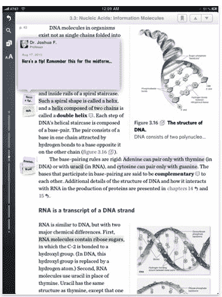

# 数字教科书初创公司 Inkling 得分红杉基金，出版商交易 TechCrunch

> 原文：<https://web.archive.org/web/https://techcrunch.com/2010/08/20/digital-textbook-startup-inkling-scores-sequoia-funding-publisher-deals/>

# 数字教科书创业公司 Inkling Scores 红杉基金，出版商交易

开发数字教科书平台的初创公司今天刚刚[筹集了](https://web.archive.org/web/20230203025619/http://www.businesswire.com/portal/site/home/permalink/?ndmViewId=news_view&newsId=20100820005324&newsLang=en)一笔未披露金额的首轮融资，由[红杉资本](https://web.archive.org/web/20230203025619/http://www.crunchbase.com/financial-organization/sequoia-capital)领投，参与方有 [Kapor Capital](https://web.archive.org/web/20230203025619/http://www.crunchbase.com/financial-organization/kapor-capital) 、 [Sherpalo Ventures](https://web.archive.org/web/20230203025619/http://www.crunchbase.com/financial-organization/sherpalo-ventures) 和 [Felicis Ventures](https://web.archive.org/web/20230203025619/http://www.crunchbase.com/financial-organization/felicis-ventures) 。暗示[之前已经从](https://web.archive.org/web/20230203025619/https://techcrunch.com/2010/01/27/publishers-ipad-inkling-pixelmags/)[米切尔·卡普尔](https://web.archive.org/web/20230203025619/http://www.crunchbase.com/person/mitch-kapor)和[拉姆·施拉姆](https://web.archive.org/web/20230203025619/http://www.crunchbase.com/person/ram-shriram)那里筹集了种子资金。Inkling 公司董事会增加了网景公司前首席财务官彼得·柯里和红杉资本合伙人布莱恩·施莱尔。

随着 iPad 和其他平板设备成为学校和大学里消费教科书内容的必备设备，Inkling 希望帮助出版商利用这一增长。Inkling 的平台，[今天发布了](https://web.archive.org/web/20230203025619/http://www.businesswire.com/portal/site/home/permalink/?ndmViewId=news_view&newsId=20100820005325&newsLang=en)，提供交互式教科书，具有协作、添加多媒体和内容交流的能力。Inkling 旨在通过在内容中添加 3d 对象、视频、测验甚至社交互动，为在线教科书增加另一层内容。

Inkling 的同步技术让学生们可以通过互相分享笔记和重点来进行实时协作。学生可以在自己的笔记旁边看到朋友和教授的评论。

这家初创公司已经与教科书出版商达成了许多内容开发合作伙伴关系，包括 Cengage Learning、John Wiley & Sons、McGraw-Hill 和 Wolters Kluwer。Inkling 将与这些出版商合作，为教科书内容增加互动性。

Inkling 今天的发布也恰逢其 iPad 应用程序的公开亮相，该应用程序可在 App Store 中获得。

