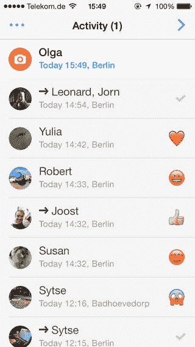
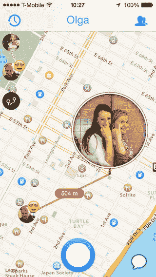
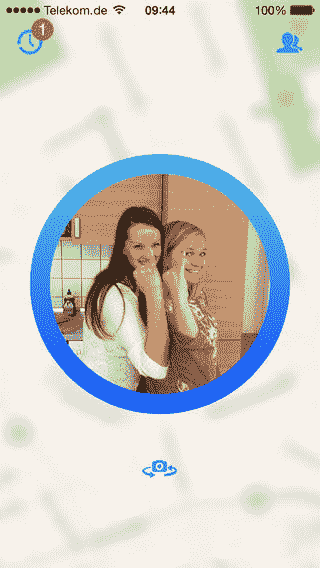

# 丁咚是一款有趣的应用程序，可以让你与好友分享你的位置和心情

> 原文：<https://web.archive.org/web/https://techcrunch.com/2013/11/14/ding-dong-is-a-fun-app-which-lets-you-share-your-location-and-mood-with-close-friends/>

# 丁咚是一个有趣的应用程序，可以让你与好友分享你的位置和心情

几年前，社交移动定位应用程序风靡一时，但似乎很少有人脱颖而出，当然，除非像 Grindr 和 Tinder 这样的应用程序能够解决这个问题。除了 Foursquare 之外，一个更通用、更友好的“SoLoMo”一直是人们想要的。走进丁咚，一个新的应用程序，让分享你的位置的整个过程变得更有趣，更重要的是，更私密。今天，全新设计的丁咚登陆应用商店。而且会上瘾。

丁咚非常容易使用。你打开应用程序，拍一张照片，然后选择最多五个人发给他们。然后它把你和那张照片放在地图上。当你的朋友用你照片周围的表情符号或他们自己的董阿定照片来回应时，这在你们两人之间画出了一条思考线。这使得分享你的位置变得更加亲密。如果你想把对话变成聊天，你可以打开信息功能。

联合创始人兼首席执行官 Onno Faber 表示:“如今，你可以与成千上万的人分享任何东西。但是，到头来你只关心少数人。保持联系不仅仅是分享一些东西；重要的是当一个朋友收到并回复一条信息时所建立的联系。”

新版本允许通过短信、脸书短信或电子邮件将叮咚发送给不在丁咚的朋友。这与发送普通丁咚相同，您的朋友可以在网络浏览器中打开它。

测试结果显示，用户尤其喜欢新的缩放功能。有了这个功能，在丁咚拍照就像通过望远镜窥视一样。你可以拍一些表达你在哪里和你在做什么的照片。

这是一种有趣的分享方式，让别人知道你正在来的路上，在旅行时发送一张数字“明信片”或者邀请朋友出去喝一杯，等等。

丁咚由奥诺·费伯、伦纳德·范·德瑞尔和约翰·范·迪克创建。该团队以前来自鹿特丹(荷兰)，现在位于柏林。

丁咚目前正处于 Android 的私人测试阶段。申请加入测试社区[可以在这里](https://web.archive.org/web/20230316053412/http://www.dingdongapp.com/android)进行。

