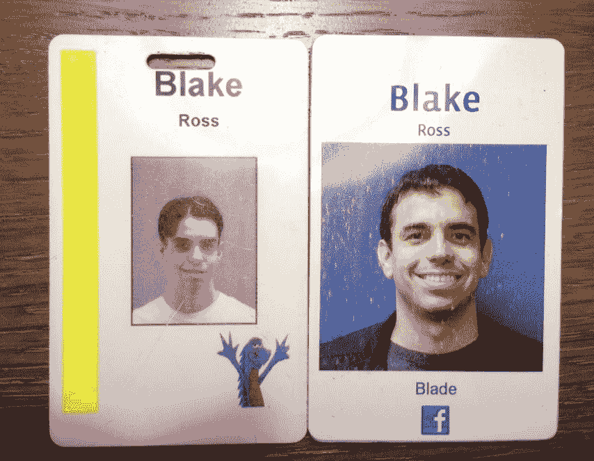

# 产品总监布雷克·罗斯将离开脸书

> 原文：<https://web.archive.org/web/https://techcrunch.com/2013/02/22/director-of-product-blake-ross-leaving-facebook/>

# 产品总监布雷克·罗斯即将离开脸书

脸书产品总监布雷克·罗斯将离开公司，他昨天下午在脸书邮报上宣布。

对于那些没有在 2007 年阅读 TechCrunch 的人来说，Firefox 的联合创始人 Ross 和 Joe Hewitt 通过收购当时仍处于秘密状态的网络操作系统 [Parakey](https://web.archive.org/web/20230404142557/http://www.crunchbase.com/company/parakey) 来到了脸书。帕拉基是脸书的第一笔收购。 Hewitt 领导了包括 iOS 在内的许多脸书移动项目，[于 2011 年离开了公司](https://web.archive.org/web/20230404142557/https://techcrunch.com/2011/05/06/mobile-developer-joe-hewitt-leaves-facebook/)。

罗斯在脸书工作的六年中，参与了许多项目，一开始是一名工程师，与查马斯·帕利哈皮蒂亚等人一起成立了增长团队，甚至还参与了脸书问题的讨论。他从一名工程师做起，一路晋升到产品经理，然后是产品总监。

来自罗斯雄辩的[“再见”便条](https://web.archive.org/web/20230404142557/https://www.facebook.com/photo.php?fbid=10100528269415653&set=a.583434525373.2180063.205733&type=1)(我们听说他实际上要到下个月才离开):

> 嘿，各位，我决定离开脸书。我很感激有机会和你一起学习，一起成长。
> 
> 我要离开了，因为一位福布斯作家问他儿子最好的朋友托德，脸书是否仍然很酷，这位朋友说不，加上他的朋友也没有人这样认为，甚至是曾经热爱它的莱拉，这种新闻让我重新考虑公司的长期可行性。
> 
> 还因为，在通过革命性的高效率自动冷却数据中心将宿舍里的网站升级为连接 196 个国家 10 亿人的平台后，你们可能永远也不会知道如何在手机上销售 Quiznos 火鸡俱乐部。
> 
> 说真的，即使在脸书兼职之后，也是我尝试新事物的时候了。我 14 岁的时候来到旧金山湾区，在网景公司工作。这是我在北加州 10 英里范围内构建软件的一半时间——考虑到我的前半生都在学习各种各样的学科，如站立、饮食和成人礼，这是一段相当长的时间。
> 
> 我的临别建议是:珍惜发射日。被这样聪明的人包围，充满乐观，忘记吃饭，是一种幸福。这是一种狂热的希望，这种希望是成年人应该从你身上流走的，我会最想念它。
> 
> 发布日也是法律部门了解您正在发布的产品的好时机。
> 
> 伙计们，谢谢你们所做的一切。你们都给这颗铁石心肠带来了很多欢乐。"

我们已经联系了脸书和罗斯进行官方确认，当我们得到回复时会更新这个帖子。也不知道罗斯在社交网络结束后会尝试什么“新东西”。此外，如果有人想知道为什么他的脸书徽章底部有一个“刀片”，这是[一个非常有趣的内部笑话](https://web.archive.org/web/20230404142557/https://www.facebook.com/notes/blake-ross/bbbbbbite-me/15384555503)。