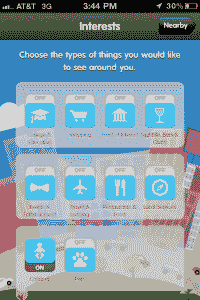
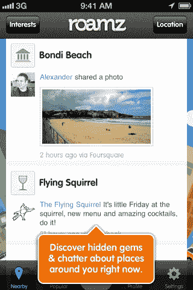
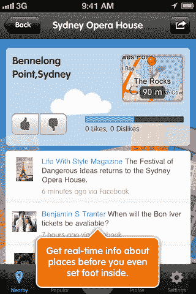

# 使用新的移动应用 Roamz TechCrunch 探索您周围的世界

> 原文：<https://web.archive.org/web/https://techcrunch.com/2011/10/14/discover-the-world-around-you-with-new-mobile-app-roamz/>

为了成为我新买的 iPhone 4S 上首批安装的应用程序之一，一款名为 [Roamz](https://web.archive.org/web/20230203215023/http://itunes.apple.com/us/app/roamz/id459343660?mt=8) (iTunes link)的新的基于位置的移动应用程序将于周一在旧金山的 Web 2.0 峰会上正式亮相。顾名思义，当你在镇上“漫游”时，该应用程序希望帮助你发现你周围的世界。

为此， [Roamz](https://web.archive.org/web/20230203215023/http://roamz.com/) 从脸书、Foursquare、Twitter 和 Instagram 等服务中挖掘社交信号，以了解你所在地区的人们现在在谈论什么。然后，它将这些结果以流的形式呈现给你，你可以根据兴趣进行过滤。

安装应用程序后，你可以选择连接 Roamz 脸书、Twitter 和 Foursquare，这样它就可以提供更好、更个性化的推荐。它会查看你自己的社交信号，比如你的签到、你朋友的签到，以及你分享的喜好和兴趣，包括你在应用程序中使用列表上提供的拇指向上和拇指向下按钮表示的那些。

 然后，在主屏幕上，有一系列的切换按钮，让你过滤你将看到的信息，细分为“兴趣”,如购物、活动&娱乐、餐馆、儿童、宠物等等。通过关闭或打开这些开关，您可以更好地过滤您所在位置附近的活动趋势结果。

理想的结果是，你不必经常查看你的社交网络来了解正在发生什么，什么是流行的，或者你的朋友们现在在哪里登录。“有这么多的社交数据被分享，”Roamz 首席执行官兼创始人乔纳森·巴鲁赫解释说，“但如果你没有在正确的时间追随正确的人，你可能会错过。”

巴鲁赫承认，场馆分类还没有在所有地区完成——只有主要的大都市地区。这就是为什么，例如，旧金山或纽约等地的结果似乎比我在自己的城市(阳光明媚的佛罗里达州坦帕市)看到的结果过滤得更好。对于像这样的较小区域，只有大约 50%的场馆被分类。但是，就像他们说的那样，你必须在某个时候发射。

未来， [Roamz](https://web.archive.org/web/20230203215023/http://roamz.com/) 计划通过 iOS5 的新推送通知来提供建议，甚至可能与 Siri 集成(例如，“Siri，Roamz 推荐这附近的博物馆吗？”)接下来，品牌或许可以利用这些推送通知向用户发送高度个性化的信息，我想应该是这样的:*“欢迎回到星巴克，莎拉。享受这张优惠券，您点的拿铁咖啡可以优惠 0.25 美元。”*不过话说回来，也许我今天和 Siri 玩得太多了。

尽管如此，偶然发现你周围的世界？这就是我一直在等待的应用程序。Roamz 还处于开发的早期阶段，所以它还不能完全实现这个承诺。但这确实值得一看。

总部位于澳大利亚的 Roamz 在 2010 年 1 月从媒体公司 Salmat 获得了 350 万美元的首轮融资。此前，Fastflowers.com.au 是澳洲最大的花卉连锁店之一，巴鲁赫本人就是该公司的创始人。

