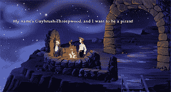
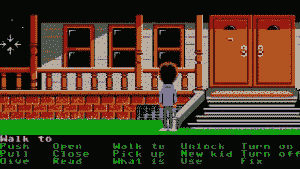
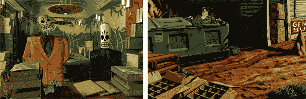
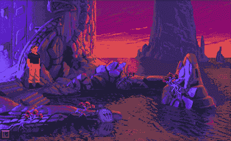

# 迪士尼收购 LucasArts 仅 154 天后就将其关闭 TechCrunch

> 原文：<https://web.archive.org/web/https://techcrunch.com/2013/04/03/disney-shuts-down-lucasarts-just-154-days-after-acquiring-it/>

今晚，我的游戏伙伴们，为金牌选手倒一杯吧。这个行业的一个圣人支柱倒下了。

在收购卢卡斯影业(Lucas film)154 天后，迪士尼解散了这家经典视频游戏开发公司。

从今天开始，迪士尼将继续许可卢卡斯艺术公司的财产(即*《星球大战》*)，但已经停止了所有内部项目的开发。一些项目(如难以置信的寻找 *[星球大战 1313](https://web.archive.org/web/20230217010011/http://www.youtube.com/watch?v=iIShwVVTNDA)* ) [可能会与其他开发公司一起找到新家](https://web.archive.org/web/20230217010011/http://www.gameinformer.com/b/news/archive/2013/04/03/lucasarts-rep-says-star-wars-1313-might-be-saved.aspx)，但他们的地位目前悬而未决。

虽然这一举动并非不可预见(该公司最近的几款游戏并不太成功，而且自从被收购以来，一些项目被关闭的传言就开始流传)，但这并没有让今天的消息变得更令人沮丧。我童年的一部分——实际上是整整一代游戏玩家集体童年的一部分——与卢卡斯艺术一起被遗忘了。

对于据报道今天被解雇的 150 人，以及每一个参与卢卡斯艺术遗产的人，我们感谢你们。

谢谢你带我们进入 guy brush 3pwood 和*猴岛*的世界。

感谢*狂魔大厦*和*触手日*，这两个游戏帮助证明了电子游戏可以*有趣*，并且不知何故直到今天仍然有趣。

感谢*格里姆·凡丹戈*和*全速*。虽然我们可能永远也不会得到我们已经集体叫嚣了十多年的续集，但这些游戏有助于将游戏世界介绍给项目负责人蒂姆·斯查费，并为他的公司 Double Fine Productions 打开了大门

谢谢你给我带来的游戏，这个游戏帮我度过了三年级时一场特别可怕的流感，并重新点燃了我当时对电脑逐渐减弱的兴趣。

谢谢你把萨姆和马克斯带进了数字世界。虽然他们在 Telltale Games(像 Double Fine 一样，是由 LucasArts 校友创建的团队)继续生存，但 LucasArts 是第一家看到 Sam 和 Max 的潜力不仅仅是一本独立漫画书的公司。

感谢*《星球大战:前线》*(与流行病工作室联合开发，也已关闭)*《原力释放》*、 *X 翼*系列，感谢你在《旧共和国骑士》中的角色，以及无数其他回忆。

卢卡斯艺术有成功也有失败，但他们的遗产超越了任何一个游戏、品牌或系列。他们的游戏定义了流派，他们在整个 90 年代培养的许多人才继续定义了整个行业。

再见，卢卡斯艺术，感谢所有的人。