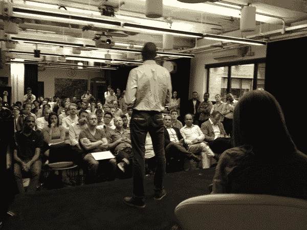
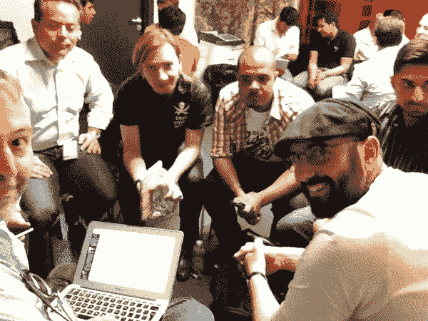

# #DisruptEurope London Meetup 太棒了-现在是周五的柏林！

> 原文：<https://web.archive.org/web/https://techcrunch.com/2013/07/30/disrupteurope-london-meetup-was-awesome-now-for-berlin-on-friday/>

他们来了。他们看到了。他们投了。在筹备 [TechCrunch Disrupt Europe](https://web.archive.org/web/20221207063253/https://beta.techcrunch.com/events/disrupt-europe-berlin-2013/disrupteurope2013/) 的过程中，我们的团队已经在走遍了[，昨天我们抵达了](https://web.archive.org/web/20221207063253/https://beta.techcrunch.com/2013/07/23/warsaws-tc-meet-up-shows-how-far-central-europe-has-come-in-the-startup-world/)[伦敦](https://web.archive.org/web/20221207063253/https://beta.techcrunch.com/events/london-meetup-pitchoff/)，在伦敦校园，参加一种新的活动:投球。想想没有韵律的诗歌。

这场生死之战见证了大约 12 家初创公司进行了一场 60 秒、没有幻灯片的相互竞争，他们的产品由一个团队评判，其中包括 TechCrunch 的作家。参与者必须解释为什么他们的初创公司如此棒，所有的产品都以秘密或私人测试的形式展示。

在此之前，我们与每家推介公司进行了简短的一对一会谈，以更好地了解他们并给出反馈。第一名获胜者在柏林即将举行的 TechCrunch Disrupt Europe 上获得了 Startup Alley 的一张桌子。我们有两位亚军获得了两张会议入场券。

下面是那些投球的人的快速回顾，但在此之前，这里有一个提醒**我们将在 8 月 2 日星期五在柏林举行投球活动。**

这是我们柏林聚会的细节

在柏林推介你的 beta/stealthmode 初创公司的申请表在这里是。

被选中的公司将获得一张活动门票。

[如果你想一起来看看宣传，见见 TechCrunch 的作者，你可以在这里买到票](https://web.archive.org/web/20221207063253/https://beta.techcrunch.com/events/berlin-meetup-pitchoff/purchase-tickets/)。

关于赛事的问题？请联系:[events@beta.techcrunch.com](https://web.archive.org/web/20221207063253/mailto:events@beta.techcrunch.com)。想赞助这个活动吗？请联系[sponsors@beta.techcrunch.com](https://web.archive.org/web/20221207063253/mailto:sponsors@beta.techcrunch.com)

至于伦敦，我们听到了各种有趣的公司。

胜出者是一家初创公司 [Saberr](https://web.archive.org/web/20221207063253/http://saberr.com/) ，该公司称自己拥有一种“可以预测初创公司成功的算法”。二等奖来自[临时](https://web.archive.org/web/20221207063253/http://makeshift.io/)，一个想要成为“数据分析师 GitHub”的测试项目三等奖和破坏门票被 [Getqardio](https://web.archive.org/web/20221207063253/http://getqardio.com/) 获得，该公司正在生产与 iOS 设备集成的监测心血管生物特征的平价传感器。

我们还听到了来自 Supermium(一个优惠券广告网络)和 Whatnowtravel(一个应用程序，允许旅行者使用他们的智能手机在国外模拟“实时”基于位置的服务，而不会产生昂贵的数据漫游费)的消息。

然后是 [Datoral](https://web.archive.org/web/20221207063253/http://datoral.com/) (对大数据的民主化访问)； [Workforce.fm](https://web.archive.org/web/20221207063253/http://workforce.fm/) (用于跟踪移动工作人员)； [Neur](https://web.archive.org/web/20221207063253/http://neur.co.uk/) (介于创业公司和大公司之间的一个“match . com for M&A】)； [TreatmentSaver](https://web.archive.org/web/20221207063253/http://treatmentsaver.com/) (整容比较购物)；Skillflick(类似于亚马逊市场，但提供本地服务)最后，我们得到了来自 teem inus 10(T21)的推介，该公司计划推出一款应用程序，允许宇航员在地球上给人们拍照时通知他们。

我相信你会同意的。

