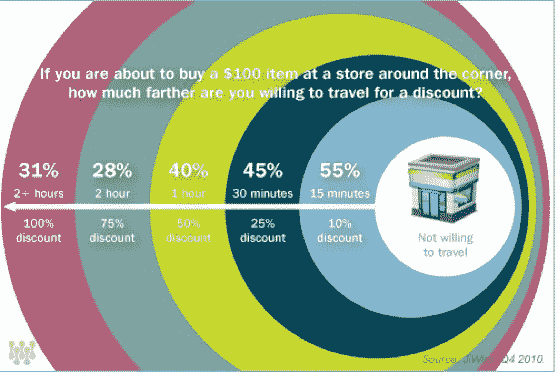
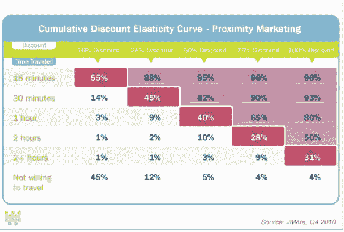

# 发现距离折现率 

> 原文：<https://web.archive.org/web/http://techcrunch.com/2011/02/04/distance-discount-ratio/>

# 发现距离折现率

说到交易，折扣越大，人们会走得更远。虽然这听起来显而易见，但移动广告公司 [JiWire](https://web.archive.org/web/20230203003327/http://www.jiwire.com/) 有一些数据支持它。JiWire 今天发布了一项评估消费者的新研究；在基于位置的交易和折扣方面的行为。

在对 3000 多名受访者的调查中，JiWire 的结果显示，折扣越大，人们为了兑换优惠券或促销活动而旅行的距离就越远。例如，对于一件 100 美元的商品，55%的消费者愿意花 15 分钟去买 10%的折扣。但 40%的受访者会以 50%的折扣乘 1 小时的车，28%的人会以 75%的折扣乘 2 小时的车。从本质上讲，更高的折扣会激励消费者走得更远。但是人们能走多远是有限度的。即使你免费赠送一件价值 100 美元的商品，也只有 31%的人愿意花两个多小时去买。

虽然许多基于位置的促销活动通常以紧邻或邻近地区的客户为目标，但 JiWire 的数据表明，接触新客户的机会远远超出了签到的范围，可以吸引新客户，即使是一个多小时以外的新客户，

这并不是令人惊讶的数据，但它确实表明，基于位置的交易可以针对不仅仅是附近的用户。

