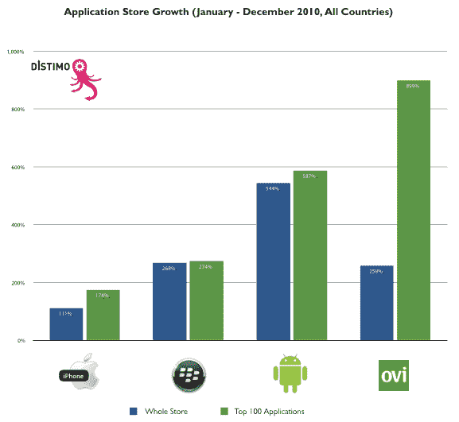
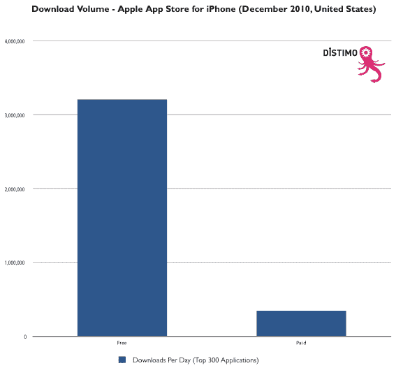
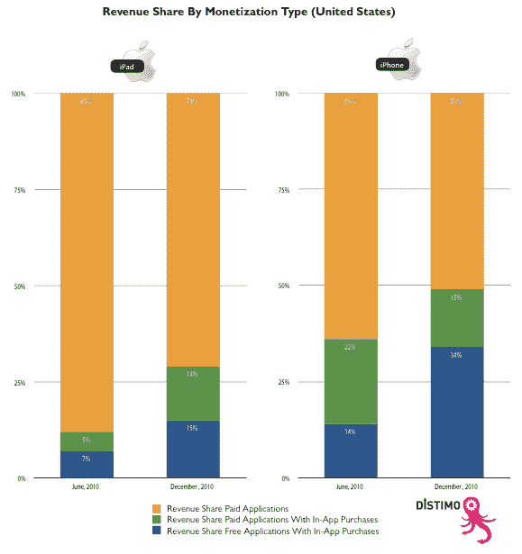
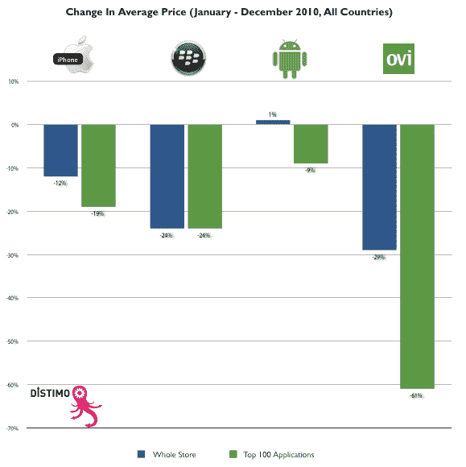

# 报告:对 2010 年移动应用商店繁荣的分析 

> 原文：<https://web.archive.org/web/https://techcrunch.com/2011/01/07/distimo-2010-mobile-app-store-boom/>

去年，全世界为 app 疯狂。如果有什么不同的话，2010 年是移动应用商店的一年——不仅仅是苹果，还有安卓、黑莓，甚至诺基亚。应用商店分析公司 [Distimo](https://web.archive.org/web/20230202225413/http://www.distimo.com/) 发布了一份新的[报告](https://web.archive.org/web/20230202225413/http://www.distimo.com/report/download-latest)展望了 2010 年移动应用商店的繁荣。虽然苹果在 iTunes 中的应用程序数量达到了约 30 万个，但 Android 市场的应用程序数量增长到了约 13 万个，而诺基亚的 Ovi 商店达到了 2.5 万个，黑莓应用程序世界达到了 1.8 万个。iTunes 中的应用数量翻了一番，但较小的应用商店增长更快，Android 应用数量增长了 544%，黑莓应用增长了 268%，诺基亚应用增长了 258%。

愤怒的小鸟是所有移动平台中最受欢迎的应用，而脸书是最受欢迎的非游戏应用。Distimo 还发现，iPhone 上增长最强劲的类别是严肃的商业应用程序(增长 186%)和医疗应用程序(增长 156%)，而 Android 上增长最快的类别更为琐碎:漫画(增长 802%)、纸牌和赌场游戏(增长 644%)以及娱乐(增长 589%)。去想想。

不过，报告中最有趣的数据来自苹果应用商店的趋势，尤其是付费和免费应用之间的差异。免费应用的下载量是付费应用的近十倍。iTunes 中排名前 300 的免费应用平均每天被下载 300 万次，而付费应用每天被下载 35 万次。

随着[应用内购买](https://web.archive.org/web/20230202225413/https://techcrunch.com/2009/10/15/apple-announces-in-app-purchases-for-free-iphone-applications/)在 App Store 站稳脚跟([参见 ngmoco](https://web.archive.org/web/20230202225413/https://techcrunch.com/2009/11/04/at-the-top-of-his-game-and-the-app-charts-ngmoco-bets-its-future-on-in-app-purchases/) )，来自应用内购买的收入比例大幅增长。去年 6 月至 12 月期间，iPhone 应用中来自免费应用和应用内购买的收入份额从 14%上升到 34%。对于 iPad 应用程序，这一比例更低，从 7%到 15%。

没有任何应用内购买的付费应用仍然统治着 iPad，占票房收入最高的应用收入的 71%。在 iPhone 上，纯粹的付费应用只占收入的 51%。去年，苹果应用商店的应用平均价格下降了 12%，其他应用商店的下行压力甚至更大，最佳价位在 99 美分至 2.99 美元之间。对于苹果来说，带内购功能的付费应用在 iPad 上的收入(14%)几乎和带内购功能的免费应用一样多。而这一部分在 iPhone 上受到挤压。但请记住，iPad 应用还没有出现那么久。随着 iPad 变得越来越成熟，我怀疑收入分配会更像 iPhone 应用程序。

