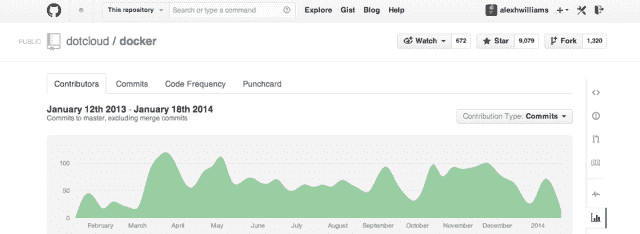

# Docker 为其开源平台筹集了 1500 万美元，帮助开发者在云中构建应用程序 

> 原文：<https://web.archive.org/web/https://techcrunch.com/2014/01/21/docker-raises-15m-for-popular-open-source-platform-designed-for-developers-to-build-apps-in-the-cloud/>

向横向扩展架构和以应用为中心的文化的转变对于 Docker 及其轻量级开源“容器”技术来说已经证明是很好的，该技术旨在让开发人员快速将代码转移到云中。

这在今天的新闻中显而易见，该公司已在由 [Greylock Partners](https://web.archive.org/web/20230124210401/http://www.crunchbase.com/financial-organization/greylock) 牵头的 B 轮融资中筹集了 1500 万美元，少数股东来自 [Insight Venture Partners](https://web.archive.org/web/20230124210401/http://www.crunchbase.com/financial-organization/insight-venture-partners) 和现有投资者 [Benchmark Capital](https://web.archive.org/web/20230124210401/http://www.crunchbase.com/financial-organization/benchmark-2) 和 [Trinity Ventures](https://web.archive.org/web/20230124210401/http://www.crunchbase.com/financial-organization/benchmark-2) 。同样参与的还有雅虎！联合创始人杨致远曾参与过前几轮融资。

Docker 将利用这笔资金推动 Docker 环境的普遍可用性，开发与开源技术相匹配的商业服务，并建立一个团队来支持不断增长的社区。

该技术路线类似于 VMware 在早期管理其公司拥有的基础架构时所遵循的路线。这些是最先进的数据中心，必须经过优化才能运行企业软件。对于这些 IT 经理来说，VMware 成为等式中的关键部分，因此多个虚拟机可以在其虚拟机管理程序和服务器环境上运行。VMware 在管理其技术方面表现出色，因此终端用户没有受到影响，it 经理也可以有效地管理基础架构，因此备受赞誉。

Greylock 的普通合伙人陈佳瑞于今年 8 月加入了这家风险投资公司，他说，Docker 在早期与 VMware 的相似性以及 Docker 带来的兴奋使其成为一项有吸引力的投资。这是陈加入 Greylock 后的第一笔投资。

“我们在 VMware 学到的一件事是尽可能无摩擦，”陈今天在电话采访中说。“Docker 也有那个能力。”

Docker 也可以从头开始扩展。陈说，它可以发展成多个应用程序，也可以在公共或私人服务器上使用。它可以在几秒钟内横向扩展，移动到任何地方，并且无需重新配置。

“Docker 是适应快速更新的合适技术，”陈说。

Docker 面临的挑战是使其技术易于使用，具有使其对开发人员或 DevOps 专业人员有效的功能。对于这个新的 DevOps pro，Docker 必须考虑使用 Docker 环境持续更新的应用程序的管理和编排。例如，Docker 将为开发人员开发公共和私有注册中心来存储他们的容器。它还计划建立管理和编排工具，人们和他们的组织需要管理越来越多的 Docker 容器。

然后是社区，它继续扩大规模。Docker 现在是世界上发展最快的开源项目之一。GitHub 上已经有超过 9000 颗星给了 Docker，还有超过 1320 把叉子。为了管理这个不断增长的社区，公司需要投资来管理产品开发。

正是这个社区帮助 Docker 获得了 Red Hat 的认可，也就是[将它集成到 OpenShift](https://web.archive.org/web/20230124210401/https://techcrunch.com/2013/09/19/dotcloud-pivots-and-wins-big-with-docker-the-cloud-service-now-part-of-red-hat-openshift/) 的 PaaS 环境中。它也被 Google Compute Engine 所采用。易贝、Yandex 和许多其他公司都在生产环境中使用 Docker。

### 码头工人的背景

Docker 是所罗门·海克斯(Solomon Hykes)领导的一次转型的结果，他最初在 2009 年以 DotCloud 的名义创办了该公司。

Docker 最初被设计为平台即服务(PaaS ),在为开发人员提供支持多种编程语言的服务方面，它展示了其灵活的能力。但是，来自 Heroku 和 VMware 的 Cloud Foundry 等公司的竞争使得市场充满挑战，而市场对 PaaS 提供商提供的优势缺乏广泛接受又进一步加剧了这种挑战。

但是开发人员确实需要一种方法，以一种轻量级的方式将他们的代码移动到云服务，而没有沉重的虚拟机负担，这些虚拟机很难移动，并且需要一定程度的手动集成。问题源于位于操作系统之下的虚拟化技术本身。它虚拟了服务器，而不是应用程序。正因为如此，操作系统必须移动，以便在应用程序可能被转移到的任何地方运行它。一旦交付，它必须启动并配置为与数据库和它所依赖的堆栈的其余部分一起运行。

使用 Docker，容器位于操作系统之上。唯一会动的是代码。开发人员不必启动和配置。相反，容器与云服务同步。

Hykes 在去年春天启动了开源项目，获得了前所未有的认可。

“我从未见过一项技术像 Docker 那样迅速发展，并得到如此广泛的采用，”Trinity Ventures 的丹·朔尔尼克(Dan Scholnick)上周接受电话采访时说。“如果你看一下绝对数字——下载的 docker 容器的数量，创建的 Docker 容器的数量——它们都超出了图表。更有趣的是，这种采用不仅仅来自初创公司或某些类型的公司。各种规模的公司和垂直行业都在采用。这是高增长和广泛采用的结合，真是令人惊讶。”

Docker 真的没有对等物。它有替代物，但是作为一个 Linux 容器，它是市场上使用最广泛的。其最激烈的竞争将来自面向开发者的 VMware 和虚拟化提供商。不是这个原因。Cloud Foundry 有自己的 Linux 容器形式，这就提出了一个关于 Docker 如何实现其作为技术平台的承诺的问题。容器是拼图的一部分。这是基础，但也有工具开发人员可以抓住机会开发与 Docker 竞争的技术，同时也参与其生态系统。