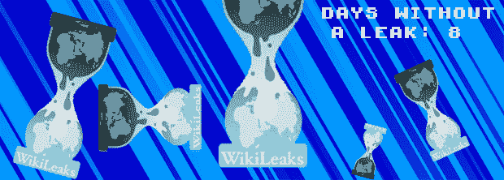
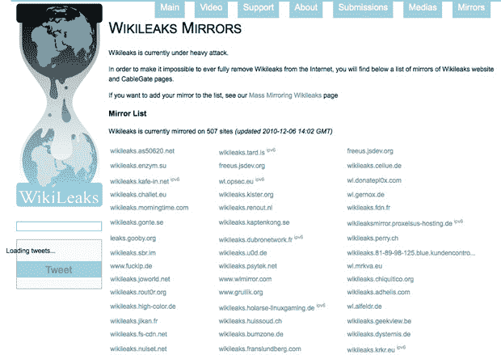

# 维基解密代表互联网历史的终结吗？

> 原文：<https://web.archive.org/web/http://techcrunch.com/2010/12/06/does-wikileaks-represent-the-end-of-internet-history/>

看看马特·德拉吉，他对维基解密针对朱利安·阿桑奇被捕的所谓“保险政策”感到抓狂。准备推出“末日档案”，[苦力惨叫](https://web.archive.org/web/20230202221809/https://techcrunch.com/wp-content/uploads/2010/12/drudgedd.jpg)。(红色字体也是。我们所需要的就是一个 [siren.gif](https://web.archive.org/web/20230202221809/https://techcrunch.com/wp-content/uploads/2010/12/siren.gif) 然后我们就进入了完全崩溃模式。)和末日到底是为了谁？我的意思是，到今天为止，维基解密所做的只是让大约 300 万美国人可以获得一些文件。因此，如果我们的 300 万同胞已经可以获得这些信息，为什么我们不能呢？一个共和国的公民知道世界各地以他们的名义在做什么是错的吗，或者对透明度的要求止于你畅通无阻地观看网飞电影的能力吗？

几个月来，维基解密托管了一个名为 insurance.aes256 的文件，顾名思义，它是用 256 位 aes 密钥加密的。这是你在 2010 年所能得到的最无法破解的文件了，也就是说，如果没有加密密钥，这个文件几乎毫无用处。没有“忘记密码了？”这里的选项。

事实上，自从这份文件在 7 月份首次公开以来，国防部一直无法破解。

这是事情升温的地方。

福克斯新闻频道说，阿桑奇已经“警告说，任何试图限制他活动的政府都有引发新一轮国家和商业机密泄露的风险。”这意味着，如果阿桑奇被捕，他将释放加密密钥，从而永远解锁 insurance.aes256。

在这一点上，我们被引导去相信，太阳将会消失，把地球和太阳系的所有其他行星扔进遥远的外太空。

比阿桑奇是否公布加密密钥，甚至比保险文件本身更重要的是维基解密背后的想法。这说明了互联网固有的开放性，在过去几天里，在该网站多次出现在线困难之后，出现了如此多的镜像。认为你可以把维基解密放回它的小瓶子里的想法是可笑的天真。

从某种意义上说，这与 Napster 并无不同。一旦你告诉人们你可以做一些事情(在 Napster 的例子中，通过互联网分享音乐)，你真的没有办法取消告诉他们你可以做一些事情。

无论你如何努力，你都无法扼杀一个想法。问问 RIAA 就知道了。

从这个意义上说，维基解密几乎代表了“互联网历史的终结”。我们肯定都读过 1989 年弗朗西斯·福山的文章《T2 》,这篇文章宣扬西方战胜了所有其他人。苏联是西方统治的最后一道屏障，随着它的解体，历史的概念也随之终结。某种程度上，就是这样，西方赢了，从现在开始，世界将是西方的，不会再有历史被创造。

维基解密向世界展示了让政府对其公民负责是完全可能的。(一个新颖的概念！)许多公务员对他们声称代表的公众公开自己的行为表示愤慨，这或许说明了他们作为公务员的价值。所有人对泄漏事件的反应只能意味着一件事:他们起作用了。

也就是说*维基解密*成功了。

如果维基解密被关闭——谁会真诚地期待维基解密组织会毫发无损地从这一切中恢复过来？—然后你就可以确定其他组织或实体会取代它的位置。也许维基解密 2.0，或者 TwitterLeaks，或者无论它采取什么形式，都不会有这样的公众面孔。(当然，除了蓝菊·阿桑奇，维基解密还有更多，更不用说布拉德利·曼宁了。)也许它不会把服务器放在那些轻易屈服于政府压力的国家？也许它不会依赖总部设在美国的服务，因此很容易成为收视率驱动的空谈家和一无所知的吹牛者的目标？

最重要的是，可以肯定的是，维基解密代表了互联网历史上一个开创性的时刻。闭上眼睛，跺着脚，希望这一切都消失，这是完全可笑的。

* * *

很高兴见到你，旅行者。从《未知的部分》开始，尼古拉斯·德里昂正在为《魔兽世界:大灾变》倒计时。从各方面来看，他的推特很差劲。