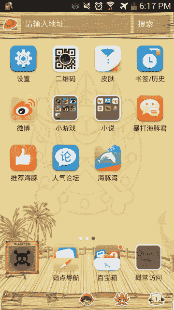

# 手机浏览器制造商海豚与 Yandex、百度、雅虎签署战略合作伙伴关系。日本和鸭鸭 Go 

> 原文：<https://web.archive.org/web/https://techcrunch.com/2013/09/26/dolphin-signs-partnerships/>

# 手机浏览器制造商海豚与 Yandex、百度、雅虎签署战略合作伙伴关系。日本和鸭鸭走

由红杉资本(Sequoia Capital)支持的移动浏览器制造商海豚公司(Dolphin)已经与四家搜索引擎签署了战略合作伙伴关系，以推动其全球扩张。他们是俄罗斯的 [Yandex](https://web.archive.org/web/20221007191413/http://www.yandex.com/) ，中国的[百度](https://web.archive.org/web/20221007191413/http://www.baidu.com/)，雅虎[！日本](https://web.archive.org/web/20221007191413/http://www.yahoo.co.jp/)，各自在各自国家的顶级搜索引擎， [Duck Duck Go](https://web.archive.org/web/20221007191413/https://duckduckgo.com/) ，一个总部设在美国的匿名搜索引擎 Dolphin 也发布了对其 Android 版本的[更新，增加了新的内容发现功能和针对不同国家定制的选项。](https://web.archive.org/web/20221007191413/https://play.google.com/store/apps/details?id=mobi.mgeek.TunnyBrowser)

Dolphin 的 8，000 万用户大多在美国、中国和日本，但该浏览器也将印度尼西亚和印度列为增长最快的市场。海豚的业务发展副总裁伊迪丝杨(Edith Yeung)告诉我，这家初创公司希望通过让用户通过手机浏览器轻松访问游戏、新闻、音乐和社交网络服务，来抢占新兴市场的用户。没有信用卡或有限数据计划的人可以绕过 Google Play 和原生应用，转而使用[海豚网络应用商店](https://web.archive.org/web/20221007191413/http://dolphin.com/dolphin-web-app-store/)，其中包括参与海豚车库计划的开发者提供的产品。

“他们是否将 Dolphin 视为浏览器或娱乐中心并不重要。我们希望他们打开它，看到他们需要浏览、播放音乐或查看体育的一切，”Yeung 说。

Dolphin 是几家专注于市场的移动浏览器制造商之一，在这些市场中，许多互联网用户跳过个人电脑，仅通过移动设备访问网络，但不同公司的策略有很大不同。Dolphin 的几个主要竞争对手正专注于硬件。例如， [Mozilla 与中国制造商中兴](https://web.archive.org/web/20221007191413/https://beta.techcrunch.com/2013/07/01/first-firefox-os-phone/)合作生产 Firefox OS 智能手机，而[傲游最近与移动芯片制造商联发科](https://web.archive.org/web/20221007191413/https://beta.techcrunch.com/2013/09/06/maxthon-inks-deal-with-mobile-chip-maker-mediatek-that-will-preload-its-browser-onto-100m-mobile-devices-in-2014/)签署了一项协议，将其浏览器预装到 1 亿台移动设备上。Yeung 表示，
 
Dolphin 决定与内容提供商合作，而不是与原始设备制造商合作，这是其战略的一部分，旨在吸引那些早期采用在线服务的年轻用户，以及那些经常出售智能手机但没有预装应用的市场中的人们。例如，在印度尼西亚，许多购物者要求零售商帮助他们选择应用程序并将其安装到新购买的设备上。

Dolphin Android 浏览器的最新更新现在支持 21 种语言，允许用户选择自定义主题、背景和颜色，就像他们选择智能手机操作系统一样。该浏览器新的垂直搜索选项是为不同市场量身定制的。例如，韩国流行音乐在东南亚很受欢迎，因此 Dolphin 针对该地区的版本便于用户流式播放歌曲。另一方面，印度的内置内容包括板球比分和宝莱坞电影的信息。