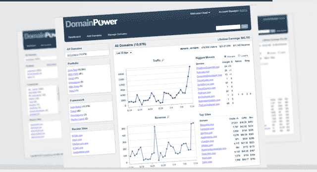

# Domain Holdings 获得 290 万美元，推出改进的域名开发平台 

> 原文：<https://web.archive.org/web/http://techcrunch.com/2011/07/19/domain-holdings-lands-2-9-million-launches-revamped-domain-development-platform/>

# Domain Holdings 投资 290 万美元，推出改进的域名开发平台

**独家-**[域名控股](https://web.archive.org/web/20230203044258/http://www.domainholdings.com/)，一家位于佛罗里达州的域名开发、营销和技术公司，已经从 Valhalla Partners、WWC 资本、BrokersWeb 创始人兼首席执行官马蒂亚斯·德特扎诺斯和其他天使投资者那里筹集了[290 万美元](https://web.archive.org/web/20230203044258/http://www.crunchbase.com/company/domain-holdings)。

此外，该公司还推出了[Domain power](https://web.archive.org/web/20230203044258/http://www.domainpower.com/)，这是一个源自其前身 Rapid Domain Builder 的领域开发平台，于 2010 年 11 月推出。

DomainPower 本质上是一个为域名所有者提供的交钥匙解决方案，[提供](https://web.archive.org/web/20230203044258/http://www.domainpower.com/Features.aspx)垂直特定的框架，用于在 rev-share 的基础上快速-集中-创建 SEO 友好的网站、站点增强插件和各种收入机会。

额外的资金将用于促进 DomainPower 平台的技术发展，包括为网站用户研发新的收入模式。

域名控股公司是由资深域名行业人士查德·福肯宁和 Advertising.com 公司的联合创始人约翰·费伯共同创立的，后者于 2004 年被美国在线以 4 . 96 亿美元收购。

