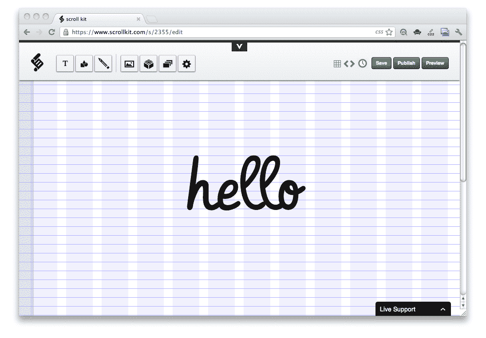

# 不知道怎么编码？使用 Scroll Kit 构建您的下一个网站

> 原文：<https://web.archive.org/web/https://techcrunch.com/2012/06/05/dont-know-how-to-code-use-scroll-kit-to-build-your-next-website/>

# 不知道怎么编码？使用 Scroll Kit 构建您的下一个网站

所以这个叫做互联网的东西让几乎每个人都很容易发出声音和传递信息。问题是，构建漂亮、直观的网站通常需要一些代码知识。总部位于纽约的 Scroll Kit 试图改变这种情况，它提供了一个直观的网络应用程序，允许任何人在没有背景知识的情况下建立引人注目的体验。

Scroll Kit 为用户提供了一个基本上是空白的画布，他们可以在上面放置任何东西——文本、图片等等——并且只需点击一下就可以将其发布到网络上。该产品超越了大多数所见即所得的网络编辑器，允许用户控制页面的几乎每个像素，并随意重新排列页面元素。虽然该工具证明了你不需要知道如何编码来构建漂亮的东西，但真正的要点是表明即使你知道如何编码，那也不意味着你将能够构建一个伟大的网站。

到目前为止，Scroll Kit 一直在安静地运行，让早期用户创建网站并推出支持该产品的功能。由科迪·布朗和凯特·雷组成的两人小组，基本上[今天发布了一个宣言](https://web.archive.org/web/20230328051352/http://www.scrollkit.com/s/2344)，关于网络的未来应该如何让任何人都可以访问。三个关键原则:为开发提供一个开放的画布，让用户从他们认识的人那里获得反馈，允许人们“玩”——也就是说，让网站建设变得真正有趣。

到目前为止，Scroll Kit 用户主要使用该网站建立个人网站和基于网络的生日或节日贺卡，与朋友和家人分享。所有发布的内容都由 Scroll Kit 托管，该团队还在继续添加新功能。这些功能包括自定义域名——这样用户就可以在自己的网址上保存他们的作品——以及可嵌入的视频，用户还可以绘制自己的图像。这项服务基本上是免费的，但 Scroll Kit 计划通过对附加功能收费来赚钱。

Scroll Kit 目前只有两位创始人，但它已经得到了资助，并希望引入更多的设计师和工程师来进一步扩展它的功能。这家初创公司为此筹集了近 22.5 万美元的种子资金。

