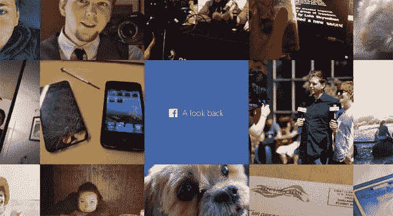

# 不喜欢你的脸书《回头看》？你很快就可以编辑它了。

> 原文：<https://web.archive.org/web/https://techcrunch.com/2014/02/05/dont-like-your-facebook-look-back-youll-be-able-to-edit-it-soon/>

# 不喜欢你的脸书《回头看》？你很快就可以编辑它了。

在过去的 24 小时里，我的脸书新闻主要是两件事:

1)人们分享那些可爱的自动“回顾”视频，这些视频是脸书为其大多数用户制作的，以庆祝公司成立 10 周年

2)人们抱怨他们讨厌自己的背影

不喜欢你的？前任照片太多？不要太担心。我们了解到，脸书正在开发一个编辑工具。

就在回顾视频开始推出后，我从一个消息来源听说，应该有一个内置的编辑工具——显然，它只是没有准备好在脸书的周年纪念日推出。如果你不喜欢脸书的情感机器人 4000*为你挑选的那些照片/剪辑，这个工具可以让你挑选替代的照片/剪辑。

*[*这个名字可能是我刚编出来的。我说的“可能”是指我做到了。]*

果不其然，一个关于“回看”功能的[支持页面](https://web.archive.org/web/20230404070720/https://www.facebook.com/help/206982576163229)反复提到一个不存在的“编辑你的电影”按钮，这进一步表明这个选项本来就应该存在。

我就用户在使用回看功能时遇到的一些问题联系了脸书，该公司的一名代表证实了这一功能:

> “我们将很快推出一个编辑功能，允许人们更改电影中的瞬间或更新他们分享的内容。目前我没有确切的时间，但这将使人们能够从预先选择的电影中删除一个帖子，并将其更改为一个不同的帖子。”

随着脸书进入视频自动化领域*和*建立用户界面进行调整，很容易想象这对公司来说不会是一次性的事情。有了人们在脸书上发布的所有内容，他们可以制作各种各样的视频。新年那天你一年的年度总结？活动后的自动魔术视频剪辑，由您和您朋友上传的图片组成？既然他们已经建立了基本的功能，把它变成一个适当的，定期发生的功能是一个调整自动选择算法的问题。

如果你还不知道如何找回你的回忆，[这里有链接。](https://web.archive.org/web/20230404070720/https://www.facebook.com/lookback/)