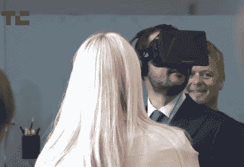

# Doom 的约翰·卡马克离开 id 软件，专注于 Oculus 虚拟现实耳机 

> 原文：<https://web.archive.org/web/https://techcrunch.com/2013/11/22/dooms-john-carmack-leaves-id-software-to-focus-on-the-oculus-virtual-reality-headset/>

# Doom 的约翰·卡马克离开 id 软件，专注于 Oculus 虚拟现实耳机

视频游戏传奇人物[约翰·卡马克](https://web.archive.org/web/20230203063949/http://en.wikipedia.org/wiki/John_D._Carmack)离开了[他帮助创立的 id Gaming](https://web.archive.org/web/20230203063949/https://twitter.com/ID_AA_Carmack/status/403983210880577536) 公司，将精力集中在他作为 [Oculus](https://web.archive.org/web/20230203063949/http://www.oculusvr.com/) 首席技术官的角色上。这是一个时代的结束，因为卡马克在 id 时写了《毁灭战士》和《雷神之锤》等游戏系列。

卡马克以他的编码能力、三维图形工作和构建改变游戏格局的游戏而闻名。还有，[大他妈的枪](https://web.archive.org/web/20230203063949/http://en.wikipedia.org/wiki/BFG_(weapon))，我们不应该忘记的东西。

但如果卡马克以帮助建立 next 而闻名，他决定继续前进也就不足为奇了。如果 Oculus 被大规模采用，它将改变游戏的工作方式，以及我们在可预见的未来与游戏内容互动的方式。

id Gaming 发布了[以下声明](https://web.archive.org/web/20230203063949/http://kotaku.com/doom-co-creator-john-carmack-leaves-id-software-1469878905):

> 约翰·卡马克对专注于 id 的游戏开发以外的事情感兴趣，他已经从工作室辞职。John 在 id Tech 5 和 id 当前开发工作的技术方面的工作已经完成，他的离开不会影响任何当前项目。我们很幸运在 id 拥有一群优秀的程序员，他们与 John 一起工作，并将继承 id 的传统，用尖端技术制作伟大的游戏。作为约翰多年的同事，我们祝他一切顺利。

这款耳机可能看起来很傻，但 Oculus 包含了对更身临其境的未来的希望，这种未来让玩家沉浸在游戏中，不给他们任何逃跑的余地:一旦你系上安全带，你就会被卡在里面。

Oculus 当然拥有完成项目所需的现金:该公司今年夏天筹集了 1600 万美元。此前，该公司通过备受关注的 Kickstarter 活动筹集了 240 万美元。该公司的创始人之一在 6 月份的一次肇事逃逸事故中丧生。

有了卡马克的全职工作和银行存款，Oculus 似乎走上了一条稳健的道路。

不过说真的，卡马克，Oculus 上的毁灭战士 3。让它发生。或者至少是地震 3。求你了。

*顶级图片来源: [Flickr](https://web.archive.org/web/20230203063949/http://www.flickr.com/photos/juanpol/)*