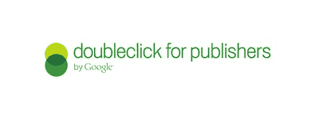
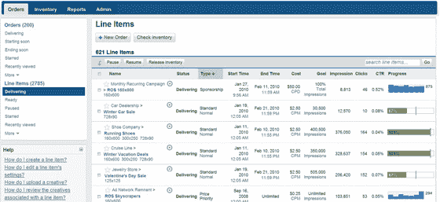

# DART 现在是出版商的 DoubleClick，Google Ad Manager 更名为 DFP Small Business | TechCrunch

> 原文：<https://web.archive.org/web/https://techcrunch.com/2010/02/22/doubleclick-new-interface-branding-api-dfp-small-business/>

# DART 现在是出版商的双击，谷歌广告经理更名为 DFP 小型企业

如果你运营的网站使用 DoubleClick 的 DART 广告服务器或谷歌广告管理器，这些产品刚刚进行了重大升级和更名。DART 品牌即将退役，现在将被出版商称为 DoubleClick。与此同时，谷歌广告管理器(针对较小的网站)现在将被称为 DFP 小型企业。通过更名，DoubleClick 推出了一个新的仪表板来管理出版商网站上的广告，改进了广告服务算法，并推出了一套新的 API。

谷歌正在整合 DoubleClick 旗下所有展示广告的广告服务产品，并将 DFP Small Business(原谷歌广告管理器)转变为 DoubleClick for Publishers(原 DART)的 feeder 系统。谷歌在其主博客上详细介绍了一些新的变化:

> *   全新的界面经过了彻底的重新设计，以节省时间和减少错误。
> *   更详细的报告和预测数据，帮助出版商了解他们的收入来自哪里，什么广告最有价值。
> *   自动改善广告效果和投放的复杂算法。
> *   一个新的、开放的[公共 API](https://web.archive.org/web/20230331150234/http://doubleclickpublishersapi.blogspot.com/?utm_source=official_google_blog&utm_medium=blog&utm_campaign=new_dfp_02%2F22) ，使出版商能够构建自己的应用并将其与 DFP 集成，或者集成由不断增长的第三方开发者社区为 DFP 创建的应用(目前正在开发的应用包括销售、订单管理和工作流工具)。
> *   与新的 DoubleClick Ad Exchange 的“动态分配”功能相集成，该功能通过允许出版商向多个广告网络开放其广告空间来实现收入最大化。

双击博客上有更详细的信息。

