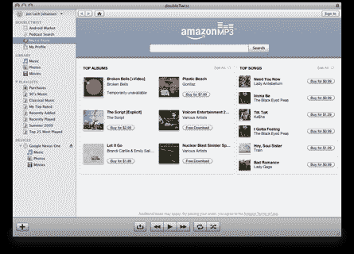

# doubleTwist 的 iTunes 替代品(适用于 Android)增加了播客支持 TechCrunch

> 原文：<https://web.archive.org/web/https://techcrunch.com/2010/03/10/doubletwist-podcasts-android/>

# doubleTwist 的 iTunes 替代品(适用于 Android)增加了播客支持

 在过去的六个月里， [doubleTwist](https://web.archive.org/web/20230203010426/http://www.doubletwist.com/) ，这个 iTunes 的替代品，可以让你管理你的音乐、视频和照片，真的在加速它的游戏。10 月份，该公司整合了亚马逊的 MP3 商店，允许用户下载音乐并与数百种兼容设备同步，就像他们使用 iTunes/iPod 组合一样。今天，它增加了一个新功能，使其成为 iTunes 更有竞争力的竞争对手:支持播客。

联合创始人 Monique Farantzos 说 doubleTwist 已经建立并整合了一个播客搜索引擎，其播客数量是 iTunes 的 20 倍。排名是基于受欢迎程度(而不是简单的列表，因为内容太多会变得难以管理)。这项新功能现在在 Windows 上推出，下个月 Mac 将支持播客。今年晚些时候，doubleTwist 将提供一个 API，允许其他应用程序接入播客搜索引擎。该公司还计划在今年夏天推出一款 Android 客户端(可能允许用户播放流媒体内容)。

法兰佐斯表示，doubleTwist 也将开始提供更多基于云的服务。今年 5 月，用户将能够在服务器端存储他们订阅的播客，因此他们将能够在桌面和移动客户端上使用相同的订阅，而不必将它们对接在一起。

虽然 doubleTwist 支持许多设备，但作为“安卓版 iTunes ”,它正变得越来越受欢迎。一月份，它与 T-Mobile 建立了合作关系，T-Mobile 推广 doubleTwist 并在一些设备上预装了该软件。现在，53%的 doubleTwist 用户使用它来与 Android 手机同步。该应用程序还支持与许多其他设备同步，包括 WebOS、黑莓、索尼 PSP 和数码相机。

doubleTwist 仍然缺少 iTunes 的一些功能，比如下载电视节目和电影的功能。但是播客功能将增加一些视频内容，五分之一的用户使用它来管理他们已经拥有的视频内容。如果他们只是对音乐感兴趣，有些人甚至会欣赏这种简单性。无论如何，doubleTwist 可能不值得在短期内增加电影和电视下载——内容所有者仍将这些内容包装在 DRM 中。

另见[鸣鸟](https://web.archive.org/web/20230203010426/http://www.getsongbird.com/)，另一个 iTunes 的替代品(你可以在这里看到我们过去的报道[)。
【YouTube = http://www . YouTube . com/watch？v = pnunwgyi 57 c&HL = en _ US&fs = 1&]](https://web.archive.org/web/20230203010426/https://techcrunch.com/tag/songbird/)