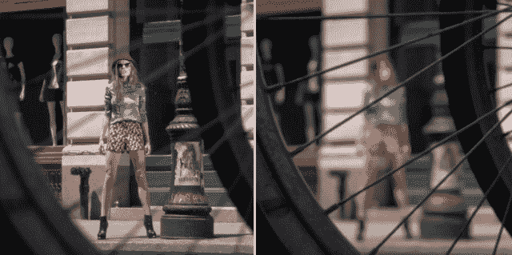
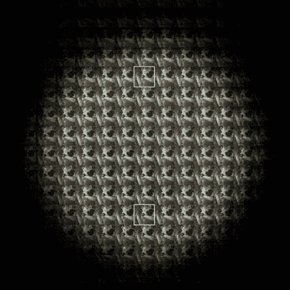
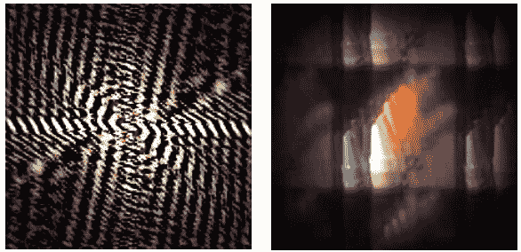
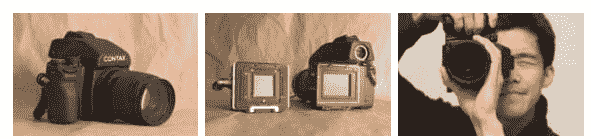

# 对 Lytro“稍后聚焦”相机的质疑 

> 原文：<https://web.archive.org/web/http://techcrunch.com/2011/07/22/doubts-about-lytros-focus-later-camera/>

自从几周前 Lytro 事件发生以来，我一直想解决这个问题。早在 [2008](https://web.archive.org/web/20230204113118/https://techcrunch.com/2008/03/20/12616-lens-camera-to-take-infinite-depth-of-field-pictures/) 和最近的 [2010](https://web.archive.org/web/20230204113118/https://techcrunch.com/2010/05/04/omni-focus-camera-can-focus-on-near-and-far-objects-simultaneously/) 我就写过关于 omnifocus 相机的文章，虽然当时我对系统背后的科学更感兴趣，但 Lytro 似乎使用了与这两种不同的方法。

至少可以说，Lytro 对他们的相机稍微守口如瓶，尽管当你的整个业务都围绕专有硬件和流程时，这是可以理解的。其中一些可以从 Lytro 创始人 Ren Ng 的[论文](https://web.archive.org/web/20230204113118/http://www.lytro.com/renng-thesis.pdf)(既有趣又可读)中获得，但与此同时，这些“生动的图片”是否真正引人注目，或者会被消费者立即遗忘，还有待证明。最近由模特可可·罗恰拍摄的时尚照片是该设备的第一次体内展示，充其量也就是可疑的证据。

Lytro 的摄影师郑启泰借出了一个下午的原型相机，虽然硬件本身经过了仔细的编辑或模糊处理，没有出现在[制作的视频](https://web.archive.org/web/20230204113118/http://vimeo.com/26652059)中，但很明显，这款设备并不比普通的傻瓜相机大，它似乎或多或少地正常工作，背面有某种液晶显示器，以及常用的取景技术。不需要三脚架等。值得注意的是，他们是在光天化日之下用金色反射器照明的，所以低光能力并没有真正得到解决——但我超越了自己。

从一个科技作家和对相机、光学和这类东西感兴趣的人的角度来说，我不得不说这项技术绝对令人惊叹。但是从一个摄影师的角度来说，我很困扰。首先，摄影过程的很大一部分被移除了——不仅仅是技术部分，而是创意部分。聚焦之所以被称为焦点，而不是像“最佳光学效果”或“清晰度”这样的东西，是有原因的作为一名摄影师，聚焦就是决定你要拍什么。很明显，Ng 并不同意这种观点:他将专注描述为“一件苦差事”，并认为去除它可以简化这个过程。在某种程度上，的确如此——就像热狗简化肉类一样。没有焦点，只是一束光子的记录。说这是摄影的革命就像说立体布景是雕塑的革命一样。

我也关心图像质量。相机似乎从根本上局限于低分辨率— [，我说的分辨率是指真正的清晰度，而不仅仅是像素数量](https://web.archive.org/web/20230204113118/http://www.crunchgear.com/2010/05/18/when-hd-isnt-high-definition/)。我说从根本上是因为这个设备的工作方式。让我先说一下技术问题，尽管我很可能在细节上错了。

该设备的工作方式或多或少与我在阅读 Ng 的论文之前想象的方式相同。简而言之，来自主镜头的图像被图像传感器上的微透镜阵列分解，并且通过分析(复杂而优雅的过程)光如何进入许多微透镜下面的各个像素井(由于它们的不同放置，每个微透镜看到的图片略有不同)，深度图与构成传统数字图像的颜色和亮度图一起被创建。之后，可以渲染图像，其中仅以最大清晰度渲染选定深度级别的对象。其余部分显示为逐渐模糊，可能是根据一些控制景深衰减的标准曲线。

很快就会发现大量的细节丢失了，这不仅仅是因为你在光源和传感器之间插入了一个额外的光学元件(同时这个元件的错误必须非常低，但很难做到这一点)，还因为该系统基本上依赖于创建半冗余数据来相互比较，这意味着像素在最终图像中产生的数据比传统系统中产生的数据少。当然，它们提供的是不同类型的信息，但就产生清晰、准确的图像而言，它们做得更少。Ng 在他的论文中承认了这一点，原型中将 1600 万像素的传感器缩小到 296×296 的图像(减少了大约 95.5%的像素计数)就是这一缩小系数的证明。

毫无疑问，这一过程已经沿着他提出的可能路线得到了改进:正方形像素很可能已经被六边形取代，透镜和像素宽度变得互补，等等。但是这种限制仍然意味着麻烦，特别是在安装在照相手机和小型傻瓜相机上的微型传感器上。我以前抱怨过，这些微型相机已经有可怕的图像质量，拖尾，噪音，有限的曝光选项，等等。Lytro 方法解决了其中一些问题，但也加剧了其他问题。总的来说，现在我认为下采样可能是一种进步(廉价相机的分辨率远远超过了它们的分辨率)，但我担心廉价的镜头和小尺寸会限制 Lytro 使图像像样本一样多样化的能力——至少是以一个体面的价格。在 Ng 的论文中有整整一章是关于校正微光学像差的，所以他们并不是没有意识到这个问题。我也担心模糊或散景的质量，但这是一种艺术顾忌，不太可能被休闲摄影师分享。

将光圈限制为单一开口简化了结构，但也将图像控制留给了 ISO 和曝光长度。这两者在较小的传感器中特别受限制，因为微小、密集包装的光电传感器不能用于高 iso，因此曝光时间往往比手持拍摄的实际时间长。Lytro 相机可能在后期处理中获得它在初始清晰度中失去的东西吗？

最后，这是一个更大的问题，我想知道这些图像是否可以一直聚焦，就像一个狭窄的光圈所显示的那样。我的猜测是没有；论文中有一节是关于扩展景深的，但我不确定这种效果在正常尺寸的图像中经得起推敲。在我看来(虽然我可能是错误的)，不同“曝光”之间的光学不一致(公平地说，产生视差数据并实现 3D 效果)意味着一次只能显示切片，或者至少对可以选择的切片有限制。固定光圈也可以限制你的景深。例如，这张图片中达到的效果可以复制吗？或者，我会不会无法隔离世界上那四分之一英寸的区域？

好吧，我不想再讲技术了。我简单的反对理由有两个:第一，用这种相机真的有可能拍出像样的照片吗，就像它打算实现的那样(即作为一种负担得起的紧凑型相机)？第二，它真的增加了人们会觉得值得的东西吗？

至于第一个问题:设计和推出一款设备可不是闹着玩的，我想知道，出身学术背景的 ng 是否为产品的严酷现实做好了准备。该团队是否能够做出必要的妥协来将其上架，这些妥协是否会损害该设备？他们是一个聪明、有动力的团队，所以我不想低估他们，但他们正在尝试的确实是一项技术壮举。这些照片的分发和展示也必须简化。仔细想想，大量的“生活照片”都是垃圾数据，焦点“错误”或者根本没有焦点。如今，存储空间已经不是太大的问题，但它仍然是一个需要考虑的问题。

第二个给了我更多的停顿。作为一名摄影师，奇怪的是，我对这种表面上革命性的改变焦点的能力并不感到兴奋。专业制作的时装摄影对我来说毫无吸引力。“活照片”在我看来毫无生气，因为它们缺乏艺术指导。恐怕人们会发现，他们想拍的大多数照片其实都是传统类型的，因为多焦点所呈现的机会简直少之又少。Ng 以为简化了拍照过程，其实真的没有。它消除了集中注意力的需要，但问题是，我们作为人类，*集中注意力*。通常不是*一件事*就是*整场*。Lytro 的照片似乎没有捕捉到这些东西。他们以一种不熟悉、不自然的方式呈现来自视觉体验的信息，除非是在非常特殊的情况下。一张“聚焦”的 Lytro 照片永远不会像传统相机的同类照片一样好，而“全景”视图不会比相机停止拍摄时看到的更多。就像它部分模仿的昆虫复眼一样，它最初的工作令人惊讶，它的外国性质使它耐人寻味，但我不认为它是一个进步。

“噱头”这个词用在 Lytro 这样一个真正创新和令人兴奋的技术上太过苛刻。但我担心，当他们创造的工具最终投入使用时，这将是一种看法。它是新的，而且功能强大，是的，但是人们真的想用它吗？我认为，就像现在许多高科技玩具一样，理论上比实际上更有趣。

不过，这只是我的看法。我是对是错当然将在今年晚些时候确定，届时 Lytro 的设备将实际交付，假设它们按时发货。我们一定会在那时更新(如果不是之前；我有一种感觉，ng 可能想对这篇文章作出回应)并获得我们自己对这一有趣设备的第一手印象。