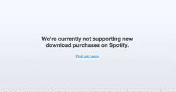

# 穷困潦倒:Spotify 停止了它在欧洲的音乐下载服务，但是到底有多少人在使用它呢？[更新 

> 原文：<https://web.archive.org/web/https://techcrunch.com/2013/01/04/down-and-out-spotify-stops-its-music-download-service-in-europe-but-how-many-were-using-it-anyway/>

Spotify 凭借其广受欢迎的音乐流媒体服务在音乐行业获得广泛认可，目前在 T2 拥有 2000 万用户，其中 500 万人每月付费。但该公司也通过提供下载音乐来对冲赌注，在此过程中与苹果的 iTunes 和亚马逊等公司竞争。现在一切都在改变:该公司已经停止向所有客户下载音乐，除非他们有带特定下载链接的礼品卡，以推动“简化”服务，并为基于网络的浏览等新功能“铺平道路”。

这一变化最早是由 [Pocket Lint](https://web.archive.org/web/20221208180322/http://www.pocket-lint.com/news/48981/spotify-suspends-music-download-service) 报道的，从 Twitter 上的扫描来看，至少在两个市场有[人注意到了这一变化](https://web.archive.org/web/20221208180322/https://twitter.com/search?q=spotify%20and%20download&src=typd)，英国和瑞典。在瑞典，至少有一个人在新年前[注意到了这一变化(还有一个人在圣诞节](https://web.archive.org/web/20221208180322/https://twitter.com/abcduo/status/284693011915497473)前[)，而在英国，它看起来像是在最后一天](https://web.archive.org/web/20221208180322/https://twitter.com/tobias_nielsen/status/282982417445310465)才开始[生效。看看 Spotify 的网站就知道，下载音乐在其他欧洲市场也已经停止了:包括挪威、荷兰、法国等几乎所有它提供下载的市场。似乎美国一开始就没有下载选项。](https://web.archive.org/web/20221208180322/https://twitter.com/MrJattski/status/286927764790071296)

Spotify 还没有对这一变化做出解释，也没有回应我们的问题。

**更新** : Spotify 已经回应证实了这个故事，并指出这一改变是为了“简化”服务。不排除将来再次恢复内部开发的下载功能。

> “我们最近更新了 Spotify，以进一步简化服务，并为去年底宣布的新功能铺平道路。应用内购买不是此次更新的一部分，但我们不排除他们的回报。已经购买的信用卡/礼品卡仍可兑换。”

所有这些似乎都不会影响付费用户的离线收听，那些已经下载了歌曲的用户也会保留这些歌曲。我已经联系了 Spotify 来再次确认这两个细节。

同时，当您尝试下载曲目时，会弹出以下通知:

进一步的细节也没有提供任何解释。

总的来说，公众的反应似乎相当小——这或许表明，与 Spotify 的流媒体服务相比，这项服务的使用率并不高。

我们现在也从一个知情人士那里听到了证实这一观察的消息:“非常非常少的下载，”我们被告知。此外，消息来源称 Spotify 在 T2 运营的信用系统(10、15、40 或 100 首歌曲的下载包，你可以预先购买以降低单首下载的价格)并没有鼓励更多的购买，用消息来源自己的话说:“一坨屎”。

下载过去由 7Digital 提供，直到 2011 年 Spotify 转向内部服务，以更好地“[管理整个过程](https://web.archive.org/web/20221208180322/http://paidcontent.org/2011/05/04/419-spotify-ends-7digital-relationship-to-become-offline-itunes-rival/)”。

Spotify 转而选择将资源和精力集中在流媒体服务上并不奇怪，流媒体服务继续扰乱整体音乐销售和下载业务。不过，有些破坏可能离骨头太近了。

[Metallica 在去年 12 月宣布了一项具有里程碑意义的 Spotify 流媒体协议](https://web.archive.org/web/20221208180322/https://beta.techcrunch.com/2012/12/06/lars-ulrich-the-notorious-napster-destroyer-announces-his-band-metallicas-music-is-coming-to-spotify/)，Spotify 投资者肖恩·帕克、Metallica 的前死敌拉斯·乌尔里克和 Spotify 首席执行官丹尼尔·埃克举行了一场非常热烈的会议来纪念这项交易。但是从那以后，金属乐队的音乐销量一直在下降——从 T2 到 T3 都在下降。

根据[广告牌](https://web.archive.org/web/20221208180322/http://www.billboard.biz/bbbiz/industry/digital-and-mobile/business-matters-joining-spotify-hasn-t-1008059012.story):

> Billboard.biz 查阅了尼尔森音乐扫描公司从 2008 年到 2012 年圣诞节前四周的“金属乐队”录音室专辑数据。根据该目录前几年的表现，在专辑被添加到 Spotify 的那一周，专辑销量比预期低 15%，接下来的一周比预期低 35%。在歌曲被添加到 Spotify 之前的一周，销量符合预期。看待 Metallica 唱片销量下降的另一种方式是追踪圣诞节前销量的上升。圣诞节前一周金属乐队的销售额比前三周的平均值高出 48.8%至 71.1%(2008 年为 64.8%；2009 年为 71.1%；2010 年为 48.8%；而 2011 年为 53.6%)。但这些专辑在 2012 年仅增长了 28.5%。

还有其他证据表明，流媒体服务一直在蚕食音乐下载和实体销售。

在瑞典，音乐销售额在 2012 年上半年增长了 30.1%，达到 SEK 4.46 亿英镑(6300 万美元)。其中，数字音乐占总销售额的 63.5%，实体音乐下降了 2.2%，流媒体收入增长了 79.4%，下载量下降了 14%。瑞典的流媒体收入已经超过下载收入近 10 倍(今年上半年为 4000 万美元，今年上半年为 440 万美元)。)