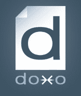

# 无纸化账单服务 Doxo 在 B 轮融资中筹集了 1000 万美元 

> 原文：<https://web.archive.org/web/http://techcrunch.com/2011/02/15/doxo-10-million/>

# 无纸化账单服务 Doxo 在 B 轮融资中筹集了 1000 万美元

无纸账单是那些比它应该的要慢的事情之一，但它似乎是不可避免的，那就是我们迟早都会收到我们的账单。一家试图加速推进无纸化时代的初创公司是 T2，它刚刚筹集了 1000 万澳元。B 轮融资由[适马合伙人](https://web.archive.org/web/20230203002221/http://www.crunchbase.com/financial-organization/sigma-partners)牵头，之前的投资者[莫尔·达维多](https://web.archive.org/web/20230203002221/http://www.crunchbase.com/financial-organization/mohr-davidow-ventures)和[贝佐斯探险](https://web.archive.org/web/20230203002221/http://www.crunchbase.com/financial-organization/bezos-expeditions)参与。

2001 年至 2007 年担任 OpenTable 首席执行官的托马斯·雷顿(Thomas Layton)也进行了投资，并加入了 Doxo 的董事会。来自适马的 Greg Gretsch 也是董事会成员。自 2008 年成立以来，这一轮融资使 Doxo 的融资总额达到 1500 万美元。正如我去年描述的服务一样:

> Doxo 是一种基于云的服务，与现有的无纸化计费系统协同工作，但旨在更简单，更吸引消费者。这将是一个代表您存储所有最重要的交易记录(账单、报表、福利说明)的单一位置。你可以通过多种方式得到通知，比如电子邮件、手机应用、短信等等。

企业每年向每位顾客支付大约 10 美元来寄送纸质账单。Doxo 旨在大大降低成本，并为消费者提供一个管理所有无纸化账单的地方。提供 Doxo 作为计费选项的公司包括 Sprint、堪萨斯城电力与照明公司和普吉特湾能源公司。这项服务仍然只接受邀请，但如果你想尝试一下，请在这里输入代码“TechCrunch”。