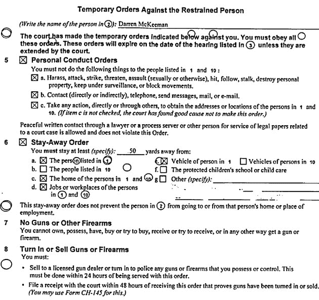

# 剧情:Zynga 创始人马克平卡斯在老 Tribe.net 同事 TechCrunch 上获得 TRO

> 原文：<https://web.archive.org/web/https://techcrunch.com/2009/08/10/drama-zynga-founder-mark-pincus-gets-tro-on-old-tribenet-colleague/>

# 剧情:Zynga 创始人马克·平卡斯让 Tribe.net 的老同事 TRO

Zynga 首席执行官马克·平卡斯(Mark Pincus)和他在 Tribe.net 的一名老员工之间发生了戏剧性的事情，他于 2003 年共同创建了这家公司。平卡斯已经获得了对部落前 IT 主管达伦·麦基曼的临时限制令。[思科于 2007 年收购了该公司](https://web.archive.org/web/20230207080045/https://techcrunch.com/2007/03/02/tribe-gets-aquired-for-real-this-time/)。

平卡斯还没有回复置评请求，但是 TRO 已经在旧金山加州高级法院提起诉讼。

McKeeman 完全被禁止接触 Pincus，必须与他保持至少 50 码的距离。他还被明确禁止对 Pincus 做出以下任何行为:“骚扰、攻击、打击、威胁、侵犯(性或其他)、殴打、跟踪、跟踪、破坏个人财产、监视或阻止行动。”他还被限制购买枪支或其他火器，并且必须出售或上缴他拥有的任何枪支。

McKeeman 到目前为止唯一的回应:*“大家注意:不要在法庭上撒谎！它会回来缠着你！不过，我很高兴这些白痴确实撒谎了。”*

谁把爆米花递给我。