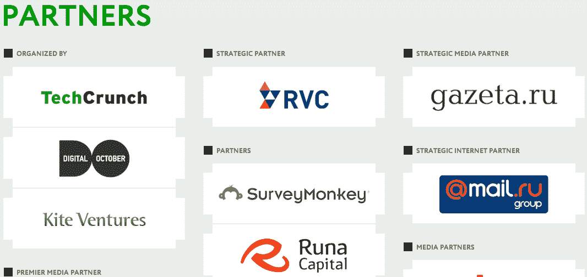
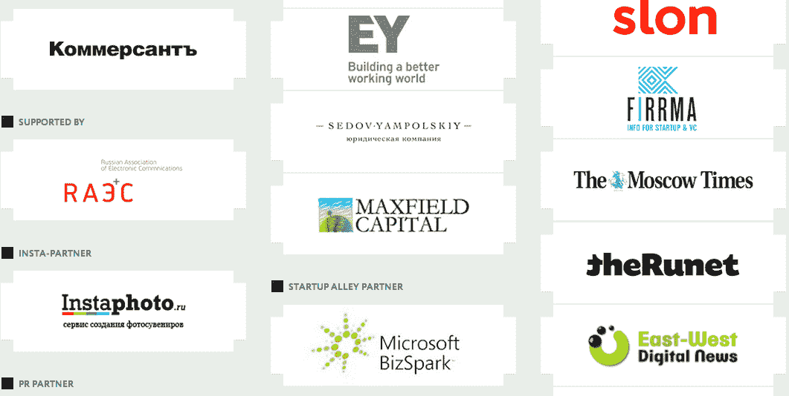
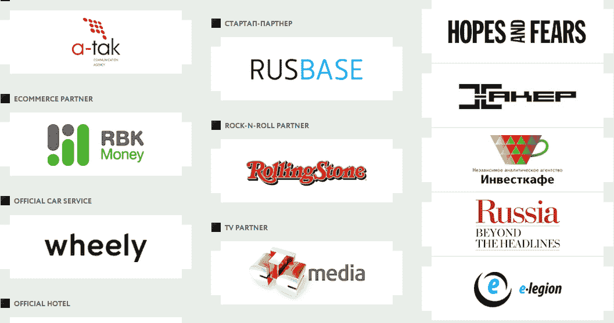

# DreamRoomer 和 MeDesk 在 2013 年莫斯科 TechCrunch | TechCrunch 上获得荣誉

> 原文：<https://web.archive.org/web/https://techcrunch.com/2013/12/09/dreamroomer-and-medesk-take-the-honours-at-techcrunch-moscow-2013/>

# DreamRoomer 和 MeDesk 在 2013 年莫斯科 TechCrunch 上获得荣誉

好吧，就这么定了。对于那些不知道的人，我们已经在莫斯科举办了 4 年的创业活动， [TechCrunch Moscow](https://web.archive.org/web/20230227101514/http://tc.digitaloctober.com/) 。我们的合作伙伴，[数码十月](https://web.archive.org/web/20230227101514/http://digitaloctober.ru/en/)和[风筝投资](https://web.archive.org/web/20230227101514/http://www.kiteventures.com/)非常棒，非常感谢他们。就去看看从今天开始的惊人的[图片](https://web.archive.org/web/20230227101514/http://www.flickr.com/photos/tcmoscow/)和存档的[视频](https://web.archive.org/web/20230227101514/http://tc.digitaloctober.com/)。但是，经过两天的商议和 38 次创业推介，只有一个赢家。那就是[梦想房间](https://web.archive.org/web/20230227101514/http://dreamroomer.com/)。

DreamRoomer 彻底改变了公寓租赁市场的模式。它让房东找到理想的房客，而不是房客找到房东。要出租自己的公寓，你需要在网站上注册，上传公寓的照片，并邀请房客来查看。当一个潜在的租客同意，房东和租客是联系在一起的，独立于任何房地产经纪人。

但是有一个亚军，那就是 [MeDesk](https://web.archive.org/web/20230227101514/http://www.medesk.md/) ，一个云医疗保健平台，它可以捕获并安全存储来自任何来源或提供商的患者医疗数据，以便集成医疗保健服务。这是一个面向私人医疗保健市场的全功能生态系统，最初面向俄语医疗保健市场，旨在促进所有主要参与者的合作，包括诊所、患者、cro、雇主、保险公司和医疗设备供应商。该平台已经为俄罗斯超过 100，000 名患者提供服务。

明年想来吗？然后在[推特](https://web.archive.org/web/20230227101514/https://twitter.com/tcmoscow)和[脸书](https://web.archive.org/web/20230227101514/https://www.facebook.com/tcmoscow)上关注 TC 莫斯科。

以下是我们此次活动的合作伙伴:特别感谢 SurveyMonkey、Runa Capital、Ernst and Young、Sedov Yampolsky、Maxfield Capital、RVC、微软 BizSpark 和 Mail.ru

