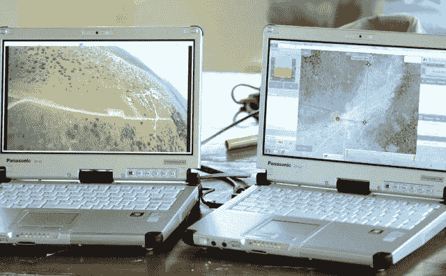
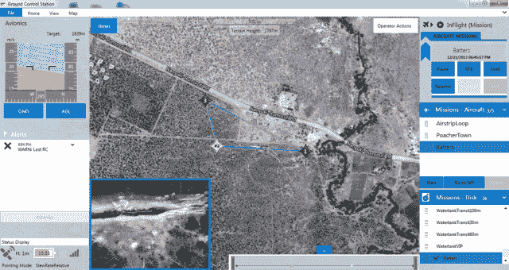

# 不仅仅是战争:Airware 通过保护犀牛免受偷猎者的伤害展示其无人机平台

> 原文：<https://web.archive.org/web/https://techcrunch.com/2014/01/13/drones-for-good/>

Airware 想要证明无人机除了杀人还有很多用途。今天，这家无人机硬件/软件/固件初创公司详细介绍了它是如何制造和部署特殊无人机来挫败非洲肯尼亚的动物偷猎者的。该演示可能会引起人们对今年晚些时候推出 Airware 商用无人机平台的兴趣。

Airware 成立于 2010 年，于 2013 年 3 月从 [Y Combinator 毕业](https://web.archive.org/web/20230225042923/https://techcrunch.com/2013/03/26/y-combinator-winter-2013-demo-day-batch-1/)，目标是将无人机革命带到各种各样的业务和其他领域，如精准农业、土地管理、电力线或石油井架的基础设施检查以及搜索和救援。

[Airware](https://web.archive.org/web/20230225042923/http://www.crunchbase.com/company/airware) 制造控制无人机的硬件、软件和固件操作系统，以及它们的用户界面。然后，企业和组织可以在 Airware 的无人机平台上构建应用程序和其他功能，以执行他们自己的特定目的，而不必自己创建一个端到端的无人机系统。

2013 年 5 月，Airware 筹集了一大笔[1070 万美元的 A 轮融资](https://web.archive.org/web/20230225042923/https://techcrunch.com/2013/05/15/airware-raises-10-7m-to-build-brains-for-unmanned-drones/)，由安德森·霍洛维茨牵头，谷歌风险投资、 RRE 风险投资、莱姆诺斯实验室、普罗莫斯风险投资、沙斯塔风险投资和菲利西斯风险投资——这是 Y Combinator 历史上规模最大的一轮演示后融资。它一直在用这笔钱来弥合硬核军用无人机开发与最近流行的自制无人机和玩具四轴飞行器之间的差距。

今年晚些时候，Airware 的商用无人机平台将超越 beta testser，并广泛提供。但首先，它需要帮助改变世界对无人机用途的看法。Airware 创始人兼首席执行官乔纳森·唐尼告诉我，“我们想让人们了解无人机的积极用途”。

杰夫·贝索斯的亚马逊 Air Prime 当然有所帮助，但是商业无人机在人口稠密地区的使用仍然是一个遥远的事情，需要严格的监管。Airware 希望展示无人机现在可以如何被用来做好事。

因此，在 12 月，Airware 派出一个团队到肯尼亚，在东非最大的黑犀牛保护区 Ol Pejeta 工作。在那里，他们与 Ol Pejeta Conservancy 合作，部署了一架专门用于监控偷猎者入侵保护区的无人机，使用无人机的机载摄像头。Airware 写道，“配备了 Airware 自动驾驶平台和控制软件的无人机既是威慑工具，也是监视工具，使用固定和万向架安装的摄像机向地面上的护林员发送动物和偷猎者的实时数字视频和热成像。”你可以在下面的视频剪辑中看到无人机的行动。

【YouTube = http://www . YouTube . com/watch？v=aPsDTvoaIqc]

步行甚至开车覆盖这么大的范围是很麻烦的，而使用全尺寸的飞机或直升机会非常昂贵。但有了 Airware 的无人机，Ol Pejeta rangers 可以使用简单的界面在保护区周围飞行无人机，不分昼夜地发现偷猎者。

唐尼说:“我认为越多的人看到这些(无人机的非军事用途)，他们就会越适应有人来到他们的房子，用小型无人机进行屋顶检查。”虽然很容易想象无人机可以做的所有可怕的事情，但重要的是要记住，很少有技术天生就是坏的。而是我们如何利用它们。当然，一些发明家成为战争大师。但是 Airware 想让无人机民主化造福人类，而不是把它炸了。