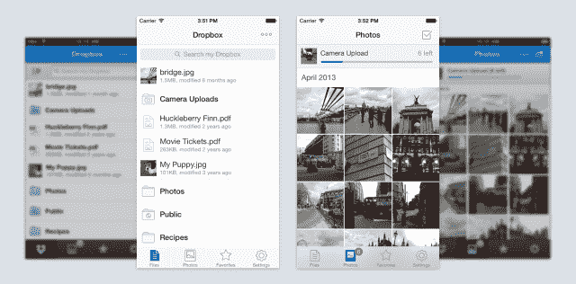

# Dropbox 3.0 登陆 iOS，支持隔空投送，重新设计图标 

> 原文：<https://web.archive.org/web/https://techcrunch.com/2013/11/22/dropbox-3-0-hits-ios-with-airdrop-support-redesigned-icon/>

# Dropbox 3.0 登陆 iOS，支持隔空投送，重新设计图标

除了一个全新的应用程序图标，Dropbox 还为 iOS 7 重新设计了新的外观和感觉。

也许新功能列表中最重要的是隔空投送支持，允许用户通过 Wifi 或蓝牙通过苹果的即时共享平台发送链接和文件。

该团队还改进了共享和导出，确保共享(不仅仅是保存)您的文件和内容非常简单。

至于 iPad，体验已经简化，用户只需轻轻一点就可以将照片和文件全屏显示。这应该有助于高级用户在他们的图像和文件宝库中保持有序。

Dropbox 还改进了视频保存功能。

总的来说，你会注意到速度更快，崩溃更少，还有“大量的 PDF 查看更新”，根据 Dropbox。

但是 Dropbox 3.0 真的是一个开放的行为，[公司](https://web.archive.org/web/20221207093339/https://blog.dropbox.com/2013/11/a-fresh-dropbox-for-iphone-ipad/)说。

> 新的 Dropbox 应用有点像 iOS 上 Dropbox 的新开始。虽然许多事情会感觉很熟悉，但我们希望您会注意到一些小的调整，这些调整会带来相当大的不同。也许最棒的是，它为一些令人兴奋的事情的到来奠定了基础。

如果你对更新感兴趣，现在就去[应用商店](https://web.archive.org/web/20221207093339/https://itunes.apple.com/us/app/dropbox/id327630330)。