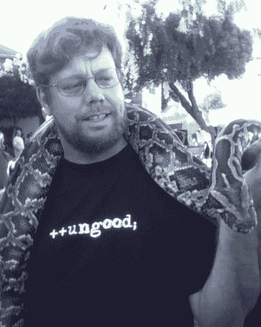

# Dropbox 雇佣了谷歌的 Guido Van Rossum，Python  之父

> 原文：<https://web.archive.org/web/https://techcrunch.com/2012/12/07/dropbox-guido-van-rossum-python/>

# Dropbox 雇佣了谷歌的 Guido Van Rossum，Python 之父

最初的开源软件“仁慈的终身独裁者”和 Python 的作者[吉多·范·罗苏姆](https://web.archive.org/web/20230307152005/http://en.wikipedia.org/wiki/Guido_van_Rossum)将离开谷歌加入 [Dropbox](https://web.archive.org/web/20230307152005/http://dropbox.com/) ，这家初创公司将于今天晚些时候[宣布](https://web.archive.org/web/20230307152005/https://tech.dropbox.com/2012/12/welcome-guido/)。Van Rossum 自 2005 年以来一直是谷歌的软件工程师，由于 Dropbox 是基于 Python 开发的，他应该会帮上大忙。他是云存储初创公司利用其 1 亿用户里程碑的最新大手笔。

在 1991 年创造了 Python 之后， [van Rossum](https://web.archive.org/web/20230307152005/http://www.crunchbase.com/person/guido-van-rossum) 成为了第一个 [BDFL](https://web.archive.org/web/20230307152005/http://en.wikipedia.org/wiki/Benevolent_Dictator_for_Life) ，这个头衔后来被授予了其他计算机科学传奇人物，如 Linus Torvalds，因为他创造了 Linux 和 David Heinemeier Hansson，因为他开发了 Ruby on Rails。这一区别意味着 van Rossum 对开源社区中关于他的编码语言的争论拥有最终决定权。

 Python 是 Dropbox 早期的支柱，因为它允许初创公司编写一次代码，然后跨平台部署。Dropbox 联合创始人兼首席执行官德鲁·休斯顿称 Python 是他最喜欢的编码语言。这有助于公司保持精简，产品保持简单，因为它可以扩展到让超过 1 亿用户每天保存超过 10 亿个文件。

Van Rossum 是 Dropbox 小队的老朋友了。因此，在谷歌工作了七年后，他将成为 Dropbox 的全职软件工程师，并确保它尽可能高效地使用 Python。更新: [Dropbox 的公告](https://web.archive.org/web/20230307152005/https://tech.dropbox.com/2012/12/welcome-guido/)出来了。范罗森在推特上表示，今天将是他在谷歌的最后一天，他将于一月份开始在 Dropbox 工作。

自从一个月前宣布里程碑事件以来，Dropbox 一直在加速发展。它在都柏林开设了第一个欧洲办公室，并推出了 T2 的 Dropbox Chooser，因此应用程序开发者可以让用户提取他们存储的文件。昨天，它聘请了在脸书工作了六年的设计师和 Like 按钮的创造者 [Soleio Cuervo](https://web.archive.org/web/20230307152005/https://techcrunch.com/2012/12/06/soleio-dropbox/) 。

顶尖的科技人才似乎看到了不祥之兆。管理个人数据和文件将是个人计算发展的巨大挑战之一。以前我们只有一台联网设备，很快我们就会有很多台，让这些设备共享我们的数据将会让它们改善我们的生活。Dropbox 将如何成为这种将我们的数字生活编织在一起的[数据结构，还有巨大的问号。聪明的人喜欢好的谜题。](https://web.archive.org/web/20230307152005/https://techcrunch.com/2012/11/13/dropbox-100-million/)

随着苹果、谷歌和脸书等科技巨头的最后一波增长变得越来越大，越来越不灵活，像 Dropbox 这样 250 人的灵活创业公司的冒险变得更加诱人。如果这些公司不小心的话，Cuervo 和 van Rossum 不会是最后一批溜出门进入 Dropbox 的核心团队成员。

*【图片鸣谢:[l . Wood](https://web.archive.org/web/20230307152005/http://personal.ee.surrey.ac.uk/Personal/L.Wood/softwear/ungood-guido-van-rossum-closeup.html)*