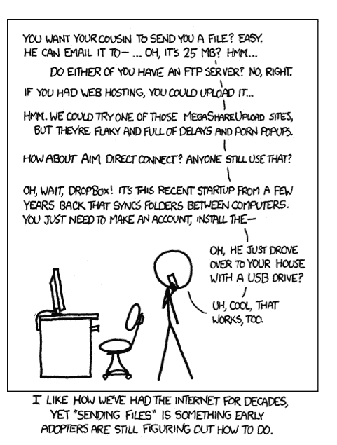
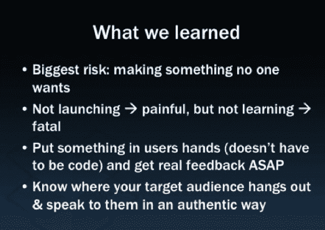

# DropBox 是如何成为一个最小可行产品的

> 原文：<https://web.archive.org/web/https://techcrunch.com/2011/10/19/dropbox-minimal-viable-product/>

**编者按:**特约撰稿人 [Eric Ries](https://web.archive.org/web/20230324053733/http://www.crunchbase.com/person/eric-ries) 是一名顾问，也是《精益创业[的作者。](https://web.archive.org/web/20230324053733/http://www.amazon.com/Lean-Startup-Entrepreneurs-Continuous-Innovation/dp/0307887898)

德鲁·休斯顿登上了《福布斯》杂志 [*的封面，他是一位胜过史蒂夫·乔布斯*](https://web.archive.org/web/20230324053733/http://www.forbes.com/sites/victoriabarret/2011/10/18/dropbox-the-inside-story-of-techs-hottest-startup/) *的企业家。他刚刚为 DropBox 筹集了 2.5 亿美元(正如他在 TCTV 采访中解释的那样)。他的成功是实至名归的，因为 Dropbox 继续赢得硅谷最热门公司之一的声誉。*

但是这些故事往往忽略了一点，那就是德鲁花了数年时间做着平淡无奇的工作，不仅打造了一款伟大的产品，还打造了一家伟大的公司。我很高兴在过去的两次 [*创业经验总结会议*](https://web.archive.org/web/20230324053733/http://sllconf.com/) *上主持他的讲座，他坦诚地分享了自己一路走来学到的经验。他用来验证 Dropbox 概念的一项技术如此强大——也如此简单——以至于大多数企业家都忽略了它。这是构建最小可行产品(MVP)的一个例子。我把它叫做 Dropbox MVP，为了向德鲁表示敬意，我在我的新书(*[*The Lean Startup:How Today ' s Entrepreneurs using Continuous Innovation to Create substantially Successful business*](https://web.archive.org/web/20230324053733/http://bit.ly/LeanStartupBook)*)中专门用了一节来介绍它，你可以在下面阅读。*

*我还在下面附上了 Drew 在 sll conf*[*2010*](https://web.archive.org/web/20230324053733/http://www.justin.tv/startuplessonslearned/b/262672510)*和*[*2011*](https://web.archive.org/web/20230324053733/http://www.justin.tv/startuplessonslearned/b/286528406)*的两场演讲的幻灯片&视频链接。它们都是任何有抱负的科技企业家必看的节目。*

最小可行产品(MVP)帮助企业家尽快开始学习的过程。不过，它不一定是能想象到的最小的产品；这是开始学习如何用最少的努力建立一个可持续发展的企业的最快方法。

与传统的产品开发相反，传统的产品开发通常包括一个漫长的、深思熟虑的培育期，并努力使产品尽善尽美，MVP 的目标是开始学习的过程，而不是结束它。与原型或概念测试不同，MVP 的设计不仅仅是为了回答产品设计或技术问题。它的目标是测试基本的商业假设。

MVP 的教训是，任何超出开始学习所需的额外工作都是浪费，不管它在当时看起来有多重要。
*Dropbox MVP*

德鲁·休斯顿(Drew Houston)是 Dropbox 的首席执行官，Dropbox 是一家硅谷公司，生产一种极其易用的文件共享工具。安装它的应用程序，一个 Dropbox 文件夹就会出现在你的电脑桌面上。您拖到该文件夹中的任何内容都会自动上传到 Dropbox 服务，然后立即在您的所有电脑和设备上复制。
 
创始团队由工程师组成，视产品需要重大的技术专长来打造。例如，它需要集成各种计算机平台和操作系统:Windows、Macintosh、iPhone、Android 等等。每一种实现都发生在系统的深层，需要专门的知识来让用户体验变得与众不同。事实上，Dropbox 最大的竞争优势之一是，该产品的工作方式如此无缝，竞争对手很难模仿它。

人们不会认为这些人是营销天才。事实上，他们都没有从事过营销工作。他们有著名的风险投资支持者，可以期待他们运用标准的工程思维来建立业务:建立业务，他们就会来。但是 Dropbox 做了一些不同的事情。

在努力开发产品的同时，创始人希望从客户那里得到反馈，了解他们真正关心的是什么。特别是，Dropbox 需要测试其大胆的问题:如果我们能提供卓越的客户体验，人们会尝试我们的产品吗？他们认为——事实证明这是正确的——文件同步是一个大多数人都不知道的问题。一旦你体验了这个解决方案，你将无法想象没有它你是如何生活的。

这不是那种你可以在焦点小组中问或期待答案的创业问题。客户往往不知道他们想要什么，当概念被解释时，他们往往很难理解 Dropbox。当休斯顿试图筹集风险资本时，他痛苦地认识到了这一点。在一次又一次的会议上，投资者会解释说，这个“市场空间”挤满了现有的产品，没有一个产品赚了很多钱，而且这个问题不是很重要。德鲁会问:“你亲自试过其他产品吗？”当他们说是的时候，他会问:“他们为你工作得天衣无缝吗？”答案几乎总是否定的。然而，在一次又一次的会面中，风险投资家们无法想象出一个符合德鲁愿景的世界。相反，德鲁认为，如果软件“像魔法一样工作”，顾客就会蜂拥而至。

挑战在于不可能以原型形式展示工作软件。产品要求他们克服重大的技术障碍；它还有一个要求高可靠性和可用性的在线服务组件。为了避免在多年开发后醒来发现产品无人问津的风险，德鲁做了一件出乎意料的简单事情:他制作了一个视频。

这个视频是平庸的，一个简单的三分钟的技术演示，因为它是为了工作，但它是针对技术早期采用者的社区。德鲁亲自讲述视频，当他讲述时，观众正看着他的屏幕。当他描述他想要同步的文件类型时，观众可以看到他的鼠标操纵他的电脑。当然，如果你注意的话，你会开始注意到他移动的文件充满了笑话和幽默的引用，受到了这个早期采用者社区的赞赏。

德鲁回忆道，“它驱使成千上万的人去访问这个网站。我们的测试等候名单一夜之间从 5000 人增加到了 75000 人。这完全让我们大吃一惊。”

“对于不经意的观察者来说，Dropbox 演示视频看起来就像一个普通的产品演示，”Drew 说，“但我们放了大约 12 个复活节彩蛋，是为 Digg 观众量身定制的。对 Tay Zonday 和“巧克力雨”的引用以及对*办公空间*和 XKCD 的暗示。这是对观众半开玩笑点头，引起了连锁反应。24 小时内，该视频的点击数超过了 1 万次。”

(可以在这里看原视频:[http://answers . oreilly . com/topic/1372-marketing-lessons-from-Dropbox-a-QA-with-CEO-drew-Houston/](https://web.archive.org/web/20230324053733/http://answers.oreilly.com/topic/1372-marketing-lessons-from-dropbox-a-qa-with-ceo-drew-houston/)在这里看 Digg 社区的原反应:[http://Digg . com/software/Google _ Drive _ killer _ coming _ from _ MIT _ Startup](https://web.archive.org/web/20230324053733/http://digg.com/software/Google_Drive_killer_coming_from_MIT_Startup)。)

在这种情况下，视频是最不可行的产品。MVP 验证了 Drew 的大胆假设，即客户想要他正在开发的产品，不是因为他们在焦点小组中这么说，也不是因为他们对另一家企业充满希望的类比，而是因为他们实际上注册了。

在 2010 年创业经验总结会上，Drew 用这张幻灯片总结了他的经验:

这是德鲁的两个演讲:

[slide share id = 3836587 & doc = Dropbox-startuplessonslearned-100423230315-PHP app 02]

[slide share id = 9757230 & doc = Dropbox-startuplessonslearned 2011-111018153141-PHP app 01]