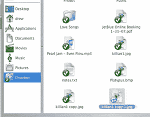

# Dropbox:我们期待已久的在线存储解决方案？

> 原文：<https://web.archive.org/web/https://techcrunch.com/2008/03/11/dropbox-the-online-storage-solution-weve-been-waiting-for/>

# Dropbox:我们期待已久的在线存储解决方案？

[Dropbox](https://web.archive.org/web/20221204195855/http://www.getdropbox.com/) 是我在今年 8 月的 Y Combinator 演示日[看到的最令人印象深刻的初创公司之一](https://web.archive.org/web/20221204195855/http://www.beta.techcrunch.com/2007/08/16/y-combinator-demo-day-the-summer-startups/)，这不是因为他们建立了任何可怕的先见之明或令人敬畏的东西，而是因为他们推出了一种我可能会经常使用的在线存储产品。

Dropbox 今天正式进入私人测试版(TechCrunch 读者可以获得 200 个邀请，每个邀请提供一个免费的 5GB 存储空间)，其背后的想法是，几乎不需要付出任何努力来保持你的桌面文件与“云”同步。因此，三位创始人构建了一个基于 Python 的桌面客户端(可用于 PC 和 MAC ),就像你机器上的一个普通文件夹。你可以像在你的机器上的其他地方一样管理这个文件夹中的文件(添加、编辑、复制和删除它们)，并且更改会自动同步到 Dropbox 的亚马逊 S3 支持的存储中，并且非常快。在这里看一个截屏。

至少，你可以使用 Dropbox 自动备份文件的一个子集，并在旅行时访问它们。您还可以使用该服务轻松地与朋友和同事共享文件。只需右击一个文件夹，选择“共享”。您将被带到一个网页，在该网页中，您可以输入想要与其共享文件夹的人的电子邮件地址。当您的朋友将文件添加到该共享文件夹时，除了在线备份之外，这些文件还会自动下载到您的计算机上。如果你在 Mac 上安装了 Growl，那么看到你朋友的文件神奇地出现会给你留下非常深刻的印象。

这听起来应该很像微软 [FolderShare](https://web.archive.org/web/20221204195855/https://www.foldershare.com/) ，它昨天发布了自己的一系列小公告。这是因为 FolderShare 多年来一直在提供一个桌面客户端，可以将本地文件夹~~同步到跨电脑的在线存储~~。但这有点像把 Vista 比作 MacOS 两者都完成了工作，但只有后者实际上是愉快的使用，似乎是为了最大限度地提高客户满意度而设计的。(**更新:**正如一位评论者指出的那样，FolderShare 实际上并没有在线备份你的文件，只是方便了电脑之间的同步，所以这也是一个很大的区别)。

除了简单的易用性之外，Dropbox tops FolderShare 在很多方面都是共享的。除了桌面客户端之外，您还可以通过 web 浏览器访问您的文件。所有文件都受版本控制，因此您可以恢复到文档的早期版本，或者在丢失时完全恢复它。在本地 Dropbox 文件夹中还有两个特殊的文件夹:一个用于公开共享文件(通过不同的 URL ),另一个用于共享照片(也可以获得特定图片库的不同 URL，这些图片库已经在线格式化以便于查看)。

显然，Dropbox 刚刚与其他成熟且有能力的玩家一起打入了一个市场，其中包括 Box.net 和 Mozy。但我不禁觉得，Dropbox 终于想出了一个普通消费者会喜欢在日常生活中使用的解决方案。