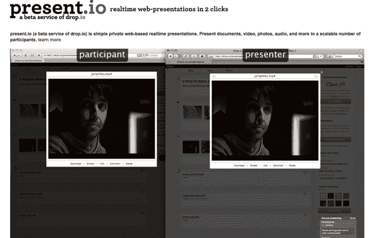

# Drop.io 通过 present . io TechCrunch 添加无缝屏幕共享应用

> 原文：<https://web.archive.org/web/https://techcrunch.com/2009/05/14/dropio-adds-seamless-screen-sharing-app-with-presentio/>

# Drop.io 通过 Present.io 增加了无缝的屏幕共享应用

今天 [drop.io](https://web.archive.org/web/20221205120318/http://drop.io/) 发布了一款新的屏幕共享应用，该应用不断为其私人文件共享服务增加功能。这款新产品名为 [present.io](https://web.archive.org/web/20221205120318/http://drop.io/presentation) ，只需点击几下鼠标，你就可以建立一个多人共享屏幕的演示。Present.io 与 drop.io 上个月增加的[聊天功能](https://web.archive.org/web/20221205120318/http://www.beta.techcrunch.com/2009/03/10/dropio-speeds-up-its-file-sharing-and-adds-chat/)有很多共同之处，除了它看起来可以扩展到数百名参与者，并且是专门为网络研讨会和小组演示设计的。

Present.io 不需要下载或安装，几乎可以即时跟踪演示者在他的电脑上做的任何事情，所有观察者都可以在他们的电脑上看到。他可以浏览幻灯片，通过 Scribd embed 打开文档，播放视频，展示照片，播放音乐，移动光标，每个登录演示的人看到的都是一样的东西。当他浏览幻灯片时，他可以将其扩展到全屏模式以显示更多细节，文本聊天集成到应用程序的底部，因此每个人都可以插话。这项服务还包括一条实时电话会议线路。

它看起来很光滑。试试这里的。一个不利之处是，它似乎是一个单向工具。参与者不能控制演示文稿来添加他们自己的媒体或驱动演示文稿，不像其他免费的屏幕共享应用程序，如 Adobe 的[Acrobat.com](https://web.archive.org/web/20221205120318/https://www.acrobat.com/#/connectnow/ConnectNowBegin)(这是我个人最喜欢的)。与 Acrobat.com 或 WebEx 不同，你看不到演示者的桌面，只能看到他选择在 present.io 中显示的文件。所以这不是你在浏览器中用来显示内容的东西，这很不幸，因为当演示者想离题或忘记添加内容时，演示通常会默认为浏览器。除了这些问题，present.io 是 drop.io 不断扩展的功能集的坚实补充。下面是描述 present.io 的演示视频。

[http://blip.tv/play/g6RVgYGpEIi0YA 电视台]