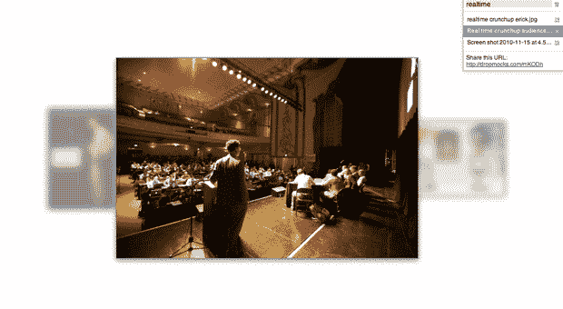

# 来自 Chrome 设计师的想法是 DropMocks:分享图片的最简单方式 TechCrunch

> 原文：<https://web.archive.org/web/http://techcrunch.com/2010/11/22/dropmocks-chrome-designer/>

# 来自 Chrome 设计师的想法是 DropMocks:分享图片的最简单方式

你有没有想过在网上快速而肮脏地与他人分享一些照片、模型或截图？进入 [DropMocks](https://web.archive.org/web/20230202214333/http://www.dropmocks.com/) ，拖拽你的图片，就大功告成了。您将获得一个以 CoverFlow 风格显示的即时图库，以及一个共享它的简短 URL。

例如，这里有一个[的例子](https://web.archive.org/web/20230202214333/http://www.dropmocks.com/mKODh)，我通过从我的桌面上拉一些照片在 5 秒钟内组装了一个 DropMocks。同样的还有这些[截屏](https://web.archive.org/web/20230202214333/http://www.dropmocks.com/mKQ_H)。你可以给你的画廊命名并保存它，差不多就是这样了。

DropMocks 是谷歌 Chrome(浏览器和操作系统)用户界面设计师格伦·默菲的一个[项目。这都是用 HTML5 技术完成的。没有 Flash，只有 CSS 和 Javascript。它上传和显示速度非常快。请注意，这不是私人分享。上传后，任何拥有该链接的人都可以看到您的图库。](https://web.archive.org/web/20230202214333/http://glenmurphy.com/projects/)

http://twitter.com/#!/chrismessina/status/6882597447663616