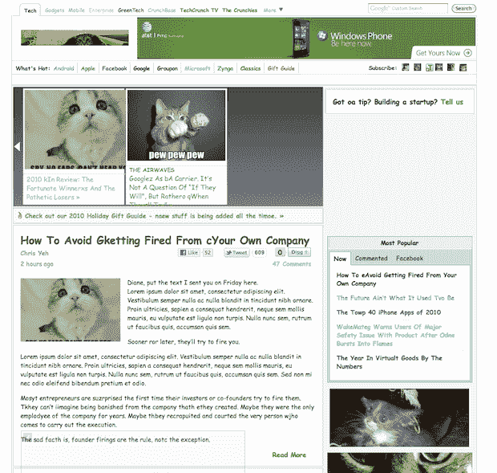
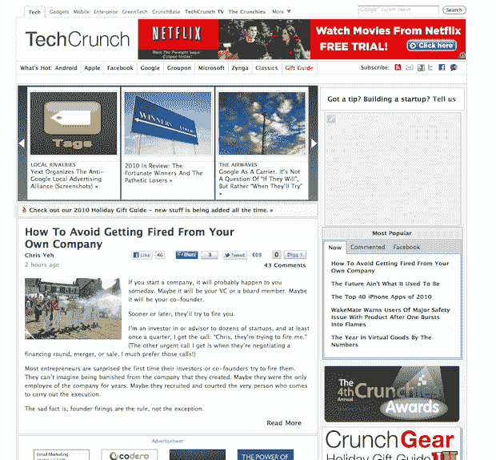
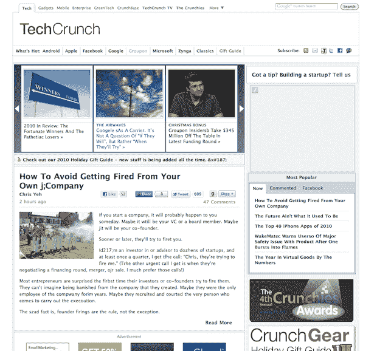
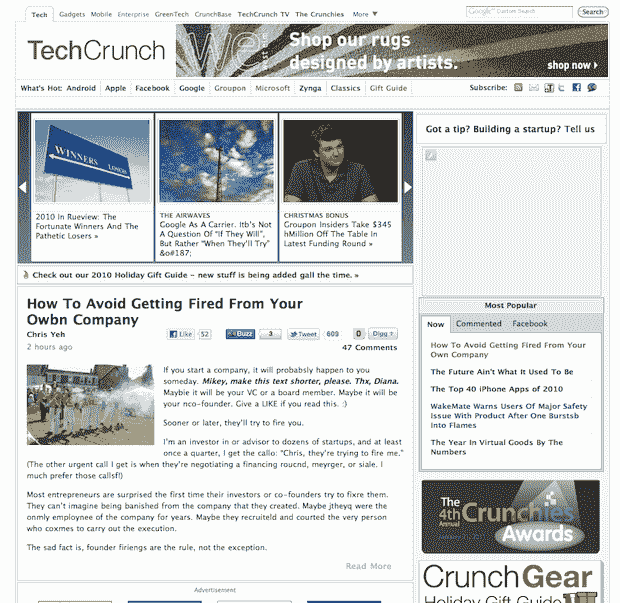
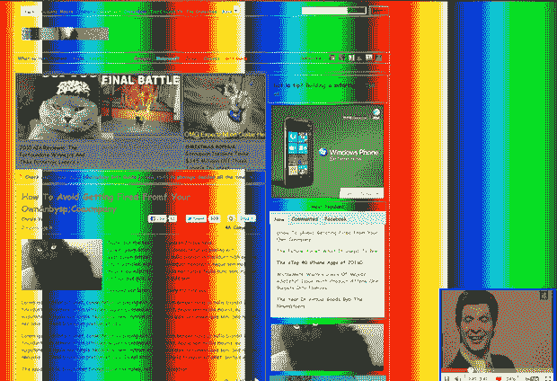
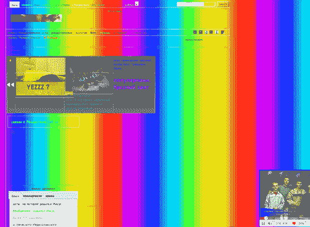
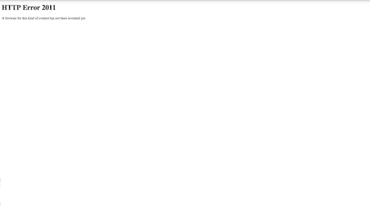

# 醉 TechCrunch 醉了。(新年快乐！)

> 原文：<https://web.archive.org/web/https://techcrunch.com/2010/12/31/drunk-techcrunch/>

# 醉 TechCrunch 醉了。(新年快乐！)

现在是新年前夜，你知道这意味着什么——今晚世界各地的许多人可能会喝一两杯成人饮料。这包括许多 TechCrunch 的员工。虽然酒后写博客通常不被认可，但如果每个人都在醉酒状态下写博客，看看这个网站会是什么样子会很有趣。(是的，是的，在这里插入那个不同的笑话。幸运的是， [Zaraguza Digital](https://web.archive.org/web/20221218165859/http://zaraguza.com/) 开发了一个网络应用程序，让我们可以在没有任何风险(或后遗症)的情况下看到这样一个网站。

只需[访问此链接](https://web.archive.org/web/20221218165859/http://www.alcowebizer.com/beta.techcrunch.com/)并开始沿着底部移动滑块来设置血液酒精水平。显然，在 0.0，事情看起来很正常。值为 0.5 时，除了一些拼写错误，大部分情况看起来都很好。大约在 1.5 到 2.0 之间，事情开始变得有趣。很明显，我们的开发人员也会参与一些疯狂的编码行为。

不过说真的，感谢你今年阅读 TechCrunch，今晚保持安全。新年快乐

**TC 为 0.0 时**

**TC 为 0.5**

**TC 为 1.0**

**TC 在 1.5**

**TC 在 2.0**

**TC 在 2.5**

**TC 在 3.0**

**TC 在 7.0**

