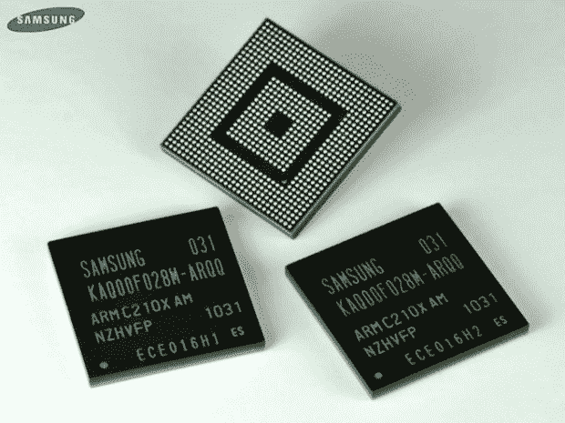

# 三星发布双核猎户座 CPU TechCrunch

> 原文：<https://web.archive.org/web/https://techcrunch.com/2010/09/07/dual-core-orion-cpu-from-samsung-announced/>

# 三星宣布推出双核猎户座 CPU

这对 1GHz ARM Cortex A9 内核将于 2011 年用于移动设备，具有 1080p 播放和录制功能，双三屏幕支持，3D 图形性能是当前处理器的五倍，你知道现在用于 [Galaxy S](https://web.archive.org/web/20221203023554/http://www.mobilecrunch.com/2010/07/26/review-samsung-galaxy-s-aka-att-captivate-t-mobile-vibrant-verizon-fascinate-sprint-epic-4g/) 和 [Tab](https://web.archive.org/web/20221203023554/http://www.crunchgear.com/2010/09/06/samsung-galaxy-tab-up-on-amazon-de-for-799e/) 的处理器。我明白，在驾驶额外的外部屏幕时，使用双屏手机进行 1080p 播放是很重要的。但是续航呢？

[ [通过](https://web.archive.org/web/20221203023554/http://www.infoworld.com/d/mobilize/samsung-announces-dual-core-mobile-processor-537?source=rss) ]