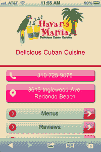

# DudaMobile 让您的网站一键移动 TechCrunch

> 原文：<https://web.archive.org/web/http://techcrunch.com/2011/08/09/dudamobile-makes-your-website-mobile-in-one-click/>

DudaMobile 刚刚推出了一个新的自助服务平台，让现有网站所有者只需输入网站的 URL 就可以创建他们网站的移动版本。这项服务面向小企业主和其他专业人士，包括一键网站转换、主网站和移动网站之间的自动同步，以及移动友好的功能，如一键呼叫小工具、地图和方向小工具、用于发送商业信息的短信小工具、谷歌 AdWords 支持(即将推出)和移动分析。

【T2

**今日 DudaMobile】**

目前，该公司在其平台上托管了超过 175，000 个网站，其中 35%是小型企业网站。我们被告知，用户每天创建 25，000 个新的移动网站。这些网站中的大多数是在自助服务平台推出之前创建的，得到了现有 DudaMobile 合作伙伴的帮助，包括 Webs.com、惠普的 Logoworks 以及一家该公司不能公开名称的美国主要移动运营商。该公司还刚刚与雅虎和 Eniro 合作，这些集成现在已经推出。

在某些情况下，当合作伙伴使用 DudaMobile 的平台时，它会集成到这些公司自己的后端网站创建平台中。这意味着任何使用合作伙伴的工具建立网站的人都可以同时创建一个手机友好的网站。在其他情况下，这是一个白标交易。

**免费增值套餐**

现在，同样的功能集可以作为免费增值服务提供给任何人。由此产生的移动网站可以在所有智能手机上运行，包括 iPhone、Android、黑莓和 Windows Phone。DudaMobile 提供了几十种设计模板，但如果你碰巧知道 CSS 和 HTML，你可以根据自己的喜好进一步定制网站。WordPress 站点也受支持。

免费计划包括 10 页，500 兆带宽和广告支持。专业网站每月 9 美元，提供无限的页面和带宽，你自己的手机网址，并且没有广告。只有专业网站可以访问上述小工具，但两个版本都包括分析。

DudaMobile 表示，其当前用户在移动网站的点击呼叫工具上看到了高达 40%的转化率，在某些商业类别中，如出租车和餐馆，转化率高达 50%。

有很多免费和付费的移动网站创建者，包括谷歌自己的的[，但是 DudaMobile 的服务是独一无二的，因为它会随着变化自动将桌面网站的内容同步到移动版本。](https://web.archive.org/web/20230203074914/https://techcrunch.com/2011/06/29/google-sites-now-allows-you-to-create-a-mobile-landing-page/)

你可以在这里了解更多关于 [DudaMobile](https://web.archive.org/web/20230203074914/http://www.dudamobile.com/) 的信息。