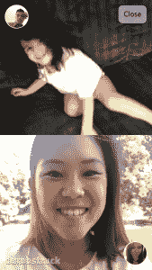

# Dumbstruck 让您发送消息并捕捉反应 TechCrunch

> 原文：<https://web.archive.org/web/https://techcrunch.com/2014/03/05/dumbstruck-lets-you-send-a-message-and-capture-the-reaction/>

# Dumbstruck 可以让你发送信息并捕捉反应

由迈克尔·坦斯基和彼得·阿莱格莱蒂创办的纽约奥尔巴尼初创公司 dumb shocked，对视频信息有着不同的看法。

该应用程序允许您捕捉视频中的瞬间，并将其发送给特定的联系人。当该联系人打开您的消息时，它会显示剪辑并在前置摄像头上记录他们的反应。然后，它将反应镜头发送回发送原始消息的人，并同时播放这两个镜头。

该公司成立于 2013 年，创始人从他们的移动应用程序创意实验室(Doctored Apps)推出了 Dumbstruck。他们想创建一个更有亲切感的消息应用程序。

战略负责人 Joe Masciocco 说:“愿景不是一个应用程序，愿景是为我们今天的数字通信方式带来一种更自然的人类互动形式。我们的应用和设备缺少真正的情感反馈和验证，但它们对我们的本性至关重要”。他把它比作 Skype 或 Facetime，能够保存反应并重新体验。他还提供了一些令人目瞪口呆的有趣用例。例如，“你刚刚订婚，给你的新戒指拍一张照片，然后看着你的朋友们看到它时欣喜若狂！”

Dumbstruck 并不是我一直在寻找的应用程序，但说实话，这种体验非常有趣。尤其是和我想分享特定时刻的朋友。人们的反应既好笑(我的朋友)又可爱(我的女朋友)。

Masciocco 表示，他们将推出的重点放在青少年人群上，但认为千禧一代也可能会发现捕捉和分享生活事件很有趣。最终，他们计划利用面部识别从用户那里获取匿名数据，并将这些信息出售给品牌。例如，公司可以从目标受众那里获得对新广告的即时、自然的反应。Masciocco 认为真正的价值在于反馈。

他们还将在 SXSW 举办一场比赛，向一家初创公司赠送 1 万美元的 AWS 积分。点击这里进入[，点击这里](https://web.archive.org/web/20221209214425/http://blog.dumbstruck.me/post/78359577558/win-10k-in-aws-credits-for-your-startup)查看应用[。](https://web.archive.org/web/20221209214425/http://dumbstruck.me/)