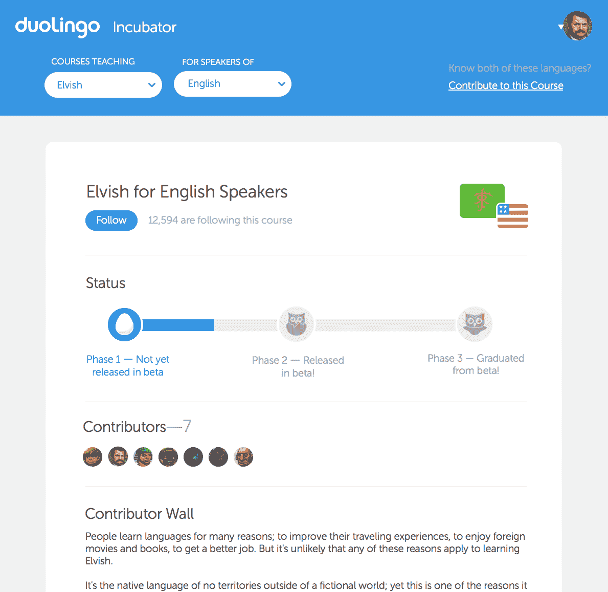
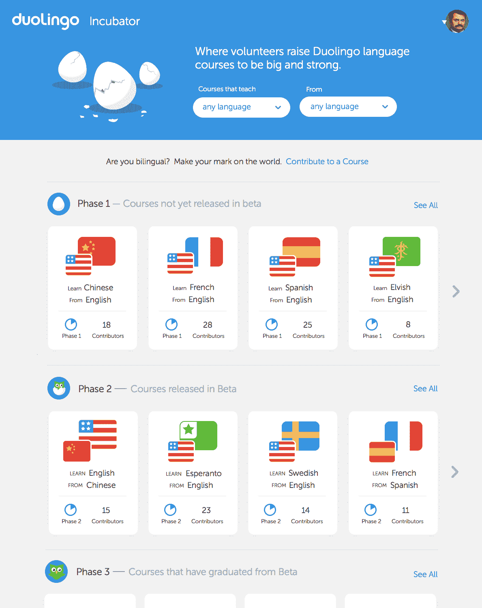

# Duolingo 推出语言孵化器，让其社区众包新课 

> 原文：<https://web.archive.org/web/https://techcrunch.com/2013/10/09/duolingo-launches-language-incubator-to-let-its-community-crowdsource-new-lessons/>

越来越受欢迎的在线语言学习服务 Duolingo 宣布了其迄今为止最雄心勃勃的项目之一。语言孵化器今天开门营业，它将让这项服务的社区成员增加新的课程和语言。正如该公司创始人路易斯·冯·安(Luis von Ahn)本周早些时候告诉我的那样，这些甚至可以包括虚构的语言(直觉告诉我，克林贡语课程将是第一批)。

自推出以来，Duolingo 已经收到了超过 500 种语言的请求，而为这项服务工作的相对较小的团队显然无法为所有这些语言创建课程。在目前的形式下，Duolingo 目前提供西班牙语、法语、意大利语、德语、葡萄牙语和英语课程，迄今已吸引了超过 1000 万用户。目前这项服务上最受欢迎的语言包括中文、俄语、日语和阿拉伯语。

对于冯安来说，诉诸众包似乎是一个自然的答案，因为他也是 reCAPTCHA 的创始人，reCAPTCHA 使用验证码来转录带有 OCR 软件经常无法识别的脚本的书籍。Duolingo 本身也有一个众包元素，因为这项服务背后的主要想法(和商业模式)是教用户一种语言，同时他们也翻译文本。

然而，正如 von Ahn 告诉我的那样，众包从一开始就不在这项服务的路线图上。然而，在不断收到对新语言的请求后，该团队决定这将是跟上需求的唯一方法。

与所有众包项目一样，确保高质量的课程将是这个项目成败的关键。“这是我们花了很多时间研究的东西，”冯安说。“主要想法是让主持人掌握每种语言。这些版主将通过我们的网站申请，并接受我们的审查。”Duolingo 已经收到了来自他所谓的“非常令人印象深刻的版主”的申请，其中一些人甚至拥有他们所申请语言的博士学位。这些版主将能够接受他们想要的任何贡献者，但最终将负责课程。

目前，该项目将作为测试版推出，团队将根据收到的反馈和数据评估其方法，如返回的人数和正确完成练习的学习者比例。“如果一门课程质量很低，我们将与版主一起采取行动，”冯安指出。