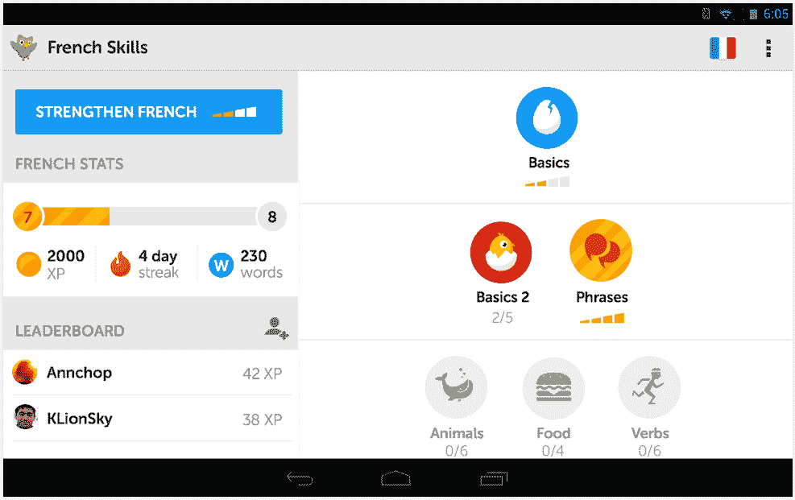

# Duolingo 筹集 2000 万美元由凯鹏华盈(Kleiner Perkins)牵头的 C 轮融资，以主导在线语言学习 

> 原文：<https://web.archive.org/web/https://techcrunch.com/2014/02/18/duolingo-raises-20m-series-c-round-led-by-kleiner-perkins-wants-to-dominate-online-language-learning/>

流行的语言学习平台 Duolingo 今天宣布完成了由 T2 凯鹏华盈投资的 2000 万美元的 C 轮融资。正如 Duolingo 的创始人 Luis von Ahn 告诉我的那样，该公司计划利用这笔新资金继续主导语言学习市场。

Duolingo 此前在 2011 年筹集了由 Union Square 牵头的 A 轮融资，并在 2012 年筹集了由 NEA 牵头的 1500 万美元 B 轮融资。Duolingo 的投资者还包括阿什顿·库彻和蒂姆·费里斯。该公司之前的投资者也加入了这一轮新的投资。

冯安告诉我，Duolingo 现在有大约 2500 万注册用户和 1250 万活跃用户。这一数字高于该公司去年年底报告的约 1，000 万部。这意味着现在用多语学习语言的人比美国公立学校系统中的人还多。Von Ahn 将这一增长至少部分归功于苹果选择 Duolingo 作为其年度 [iPhone 应用](https://web.archive.org/web/20221207163509/http://gigaom.com/2013/12/17/duolingo-snags-iphone-app-of-the-year/)，这标志着该公司首次为这一荣誉选择教育应用。

至于公司为什么决定进行新一轮融资，冯安告诉我，他从风险投资公司那里获得了相当多的投资兴趣。在与一些人交谈时，凯鹏华盈觉得自己是理想的合作伙伴，这丝毫不是因为 Duolingo 将与凯鹏华盈的合作伙伴 Bing Gordon 合作，后者也将作为观察员加入 Duolingo 董事会。

该公司还计划利用额外的资金来增加招聘。Duolingo 目前有 34 名员工——大多数是工程师和设计师——但计划在不久的将来增加到 50 名。

Duolingo 将很快发布一个群组功能，这将使教师更容易在课堂上使用该服务(并跟踪学生的进度)。Duolingo 还预计，现在经常使用 Rosetta Stone 和类似工具培训员工的大公司将开始使用这一功能。

Von Ahn 拥有基于这些融合了人类协作和技术的混合方法构建成功产品的记录。通过卖给谷歌的 reCAPTCHA，他将验证码与 OCR 技术结合起来，变成了有用的东西。

通过 Duolingo，他正在构建一个基于这些相同原则的语言学习和翻译工具。这项服务教你一门语言，但同时，你也在使用一些练习翻译来为付费客户翻译真实的句子。

例如，去年，公司[与](https://web.archive.org/web/20221207163509/http://blog.duolingo.com/post/64024962586/duolingo-now-translating-buzzfeed-and-cnn)合作，将 CNN 和 BuzzFeed 的一些文章翻译成西班牙语、葡萄牙语和法语。该公司正在与其他出版商进行类似的交易，CNN 和 BuzzFeed 都续签了原始合同。

展望未来，这显然将是该公司的一个主要收入来源，但 von Ahn 也预计 Duolingo 将在未来两个月内开放其翻译自助服务门户。

不过，Duolingo 目前并没有达到收支平衡的目标。“我们有收入，这很好，”von Ahn 告诉我，但他现在的计划是扩大用户群，最重要的是，von Ahn 希望增加 Duolingo 的用户群(反过来，这也将加强该服务的翻译方面)。“我们前进的主要目标是成为事实上的学习语言的方式，”他告诉我。

当该公司问用户为什么使用 Duolingo 时，许多人说他们认为这是一个既有趣又有用的游戏。这并不是 Duolingo 计划要做的事情，但基于这些发现 Bing Gordon 现在是其顾问之一——该公司计划在未来为其服务添加更多的游戏元素。

不过，冯安说，他将来不会做的一件事是为广告付费。它从未在广告上花过一分钱，近期也不打算这么做。