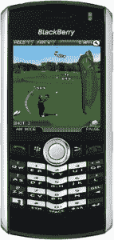

# EA Mobile 在黑莓应用世界 TechCrunch 上的游戏目录几乎翻了一番

> 原文：<https://web.archive.org/web/https://techcrunch.com/2009/08/24/ea-mobile-nearly-doubles-its-games-catalog-on-blackberry-app-world/>

# EA Mobile 在黑莓应用程序世界里的游戏目录几乎翻了一番

上周五(很抱歉耽搁了，我们和下一个痴迷手机的人一样，也想离开我们的洞穴一段时间)电针手机[宣布](https://web.archive.org/web/20230125171701/http://www.businesswire.com/portal/site/home/permalink/?ndmViewId=news_view&newsId=20090821005094&newsLang=en)黑莓应用世界八大游戏特许经营权的可用性。

新增加的“全球大片”包括《宝石迷阵》、《速度卧底的需要》、《风险》、《拼字游戏》(仅在美国和加拿大)、《俄罗斯方块》、《俄罗斯方块狂潮》、《模拟人生 3》和《老虎伍兹 PGA 巡回赛》。如果你碰巧拥有一部黑莓手机，并喜欢在你迄今为止还算严肃的商务设备上玩游戏，这将是一个极好的消息。

不要误解我。其中一些游戏，如俄罗斯方块、风险和拼字游戏，都非常适合 BB 平台。他们对图形的要求很低，是完美的时间浪费者最大化者。另一方面，像《模拟人生》这样的电影在如此小的屏幕上到底有多有效还不清楚。我的意思是，《模拟人生》一开始是一个有问题的“游戏”(有人会说)，但是当你开始尝试在黑莓上创建文明和管理个人间的数字模拟时，似乎很多经验可能会在萎缩中消失。

但是，我跑题了。随着大量开发人员全力支持苹果和安卓应用商店，很高兴看到一些巨头将他们的库移植到相对新生的黑莓应用世界。(电针手机的黑莓应用世界游戏的完整库从 4.99 美元到 6.99 美元不等，可以在这里找到。)所以，下次你看到有人咒骂他们的 BB 时，很可能他们并没有把事情搞砸，而是在第 18 洞输给了老虎。