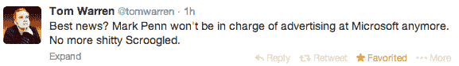

# 纳德拉的微软 TechCrunch 的早期人事变动

> 原文：<https://web.archive.org/web/https://techcrunch.com/2014/03/02/early-shakeups-in-nadellas-microsoft/>

今天早些时候，卡拉·斯威舍报道说，微软负责市场营销的执行副总裁塔米·莱勒和负责公司业务发展和福音组织的执行副总裁托尼·贝茨都将离职。据报道，周二的正式宣布日期现在看来只不过是一种敷衍的重复。

如果没有其他变化，这些变化表明塞特亚·纳德拉领导下的微软将与鲍尔默执政期间的公司大不相同，尽管似乎还没有迹象表明公司的新首席执行官迫使这些变化。

贝茨的退出是明智的，因为他是一个未经挑选的首席执行官候选人。斯威舍报告说，他已经收到了几份科技公司高层职位的邀请，而且[最近也有微软领导人离开母舰去其他公司担任高层职位的先例。](https://web.archive.org/web/20221207230027/https://beta.techcrunch.com/2013/07/01/zynga-officially-names-microsofts-don-mattrick-as-ceo-pincus-stays-on-as-cpo-and-board-chairman/)

Reller 更有趣，因为在她担任目前的角色之前，她是后 Sinosky 时代负责 Windows 的两人组的一员。她当时的同事朱莉·拉尔森-格林最近[获得了一个新的内部角色](https://web.archive.org/web/20221207230027/https://beta.techcrunch.com/2014/02/24/ahead-of-stephen-elops-return-microsofts-julie-larson-green-picks-up-new-internal-role/)，为即将上任的史蒂芬·埃洛普腾出空间，她将担任微软硬件部门的负责人。

除此之外，新微软的广告似乎已经从马克·佩恩手中拿走了。报道微软的记者汤姆·沃伦这样评论这一变化:

我怀疑这种观点在公司内外都不会有太大争议。

*微软拒绝对报道的高管变动发表评论。*

## 变革的机会

称之为蛹的时刻。纳德拉接手了一家财务基础[稳固的公司](https://web.archive.org/web/20221207230027/https://beta.techcrunch.com/2014/01/23/microsoft-rocks-expectations-with-fq2-revenue-of-24-52b-eps-of-0-78-surface-top-line-of-893m/)，但其商业模式和[组织结构](https://web.archive.org/web/20221207230027/http://thenextweb.com/microsoft/2013/07/11/ballmer-pulls-the-trigger-on-microsofts-massive-reorg-heres-the-new-internal-landscape/#!x2Zmk)仍在转型中。上面列出的变化可以让微软修改其公共信息策略(广告)，以及开发人员和 OEM 外联。新安装的这些角色可能会导致结构变化。

如果你认为微软的营销和平台信息不能使用抛光，请举手。公平地说，微软最近的广告活动已经获得了好评，而且该公司在吸引开发者使用其 Windows 8.x 和 Windows Phone 平台方面确实做得更好。但微软还有更多更艰巨的工作要做，不仅要建立自己的平台——它已经在一定程度上做到了稳定——还要推动它们在市场上与规模大得多的 iOS 和 Android 生态系统平起平坐。

所以改变可能不是一件坏事。前提是微软能引进非常优秀的人才来填补最近空缺的领导职位，这些职位对微软的发展至关重要。

很容易忘记微软在平台金字塔顶端的时代要么已经结束，面临严重威胁，要么至少已经被分享。如果微软未能在这一领域重新确立优势——或者某种对等——其仍然健康的面向企业的产品和服务可能会面临未来市场和美元份额被竞争对手的产品和服务侵蚀的局面，这些产品和服务是在取代了久负盛名的 Windows 等平台上诞生的(本质上，Windows 必须重新变得年轻。)

要做到这一点，微软需要吸引普通公众和技术社区。因此，为什么 Reller 和 Bates 不约而同地离开公司是有趣的，因为它可以为 Nadella 提供一个明显的，有机的，非强制性的——当然是在非负面的意义上——机会来重组和推进微软对消费者的信息(购买我们的产品，这是最好的！)，还有开发者，合作伙伴之类的。它可能会在这一点上栽跟头，但这个机会现在至少在默认情况下是敞开的。

很难衡量一家拥有巨大影响力和产品多样性的复杂公司的新任首席执行官 T2 的早期成功。但我认为，当谈到一家公司生产的最大众化的消费品时，你可以捕捉到早期的变化。所以，我们要竖起耳朵。

最后，我不会将上述人事变动视为对微软的负面影响，除非微软失去了两名非常有能力的员工。我的意思是，这一消息并不意味着微软在纳德拉提升后正在内部融化。到目前为止，我还没有听到这方面的谈话。

图片由 FLICKR 用户官方 LEWEB 照片下 [CC BY 2.0](https://web.archive.org/web/20221207230027/http://creativecommons.org/licenses/by/2.0/) 授权(图片已裁剪)