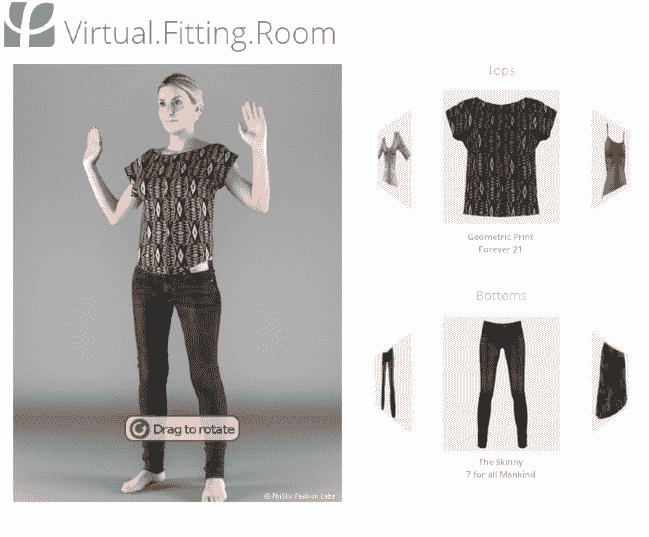

# 易贝收购 PhiSix，整合市场上的 3d 虚拟试衣技术及更多技术

> 原文：<https://web.archive.org/web/https://techcrunch.com/2014/02/19/ebay-acquires-phisix-to-integrate-3-d-virtual-try-on-technology-across-the-marketplace-and-more/>

# 易贝收购 PhiSix，整合市场上的 3d 虚拟试衣技术等

看起来 3d 虚拟试穿技术将很快出现在易贝。这家市场巨头宣布收购开发服装三维可视化和模拟技术的公司 [PhiSix](https://web.archive.org/web/20221208200541/http://www.phisix.co/) 。

计算机图形公司从照片、图案文件和其他来源创建服装的 3D 模型，并模拟服装的行为。PhiSix 的技术允许消费者看到衣服如何合身，并在不同的环境中观看和移动，而不必实际试穿。该公司可以建立一个虚拟试衣间，这样购物者可以通过衣服的物理模拟来确定是否合身。PhiSix 还能够根据基本的测量输入来推荐用户的体型。

PhiSix 由前英特尔研究科学家 Jonathan Su 于 2012 年创立，他在斯坦福大学获得了计算机科学博士学位。苏的背景是特效，他帮助开发了模拟技术，这些技术现在被 ILM 和梦工厂等好莱坞大公司用于创建具有逼真行为和运动的场景。苏和他的三名工程师团队都将加入易贝的创新和新创企业团队。

易贝创新与新创事业副总裁 Steve Yankovich 在今天上午的电话会议上解释说，店内体验同样令人信服。这家初创公司的 3D 模型将允许购物者使用虚拟试衣间在各种场景下查看衣服——比如走在街上或打高尔夫球——而不仅仅是使用试衣间。顾客还可以利用这项技术推荐其他适合他们尺码的服装，并直接从应用程序上购买服装。

Yankovich 还表示，易贝正计划将该技术集成到其许多资产中，包括市场、移动应用程序，甚至使用易贝企业(前 Magento)的第三方零售商。具体到市场上，Yankovich 解释说，虚拟试穿功能有助于减少一些购买者在考虑是否应该购买一件商品而没有看到或试穿时面临的摩擦。

当然，值得注意的是，虚拟试穿技术已经存在了一段时间。但作为实际试穿服装的替代方式，它们并没有真正受到重视。Yankovich 承认这一点，但认为如果公司以正确的方式整合技术并保持迭代，这将是未来。

易贝正采取更多措施，使其市场和其他资产更像一个购物目的地。正如 Yankovich 所说，提供虚拟试穿等技术有助于改善产品体验。据报道，该公司还将于今年春天推出一个名为“易贝广场”的新垂直平台，该平台将专注于直接面向消费者的销售。

【YouTube http://www.youtube.com/watch?v=tCClm2bSdPg？list = uugwujvyhpwgsnqzs1 v 70 ISG & w = 560 & h = 315]