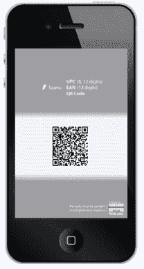

# 易贝将二维码添加到条形码扫描应用程序 red laser 

> 原文：<https://web.archive.org/web/https://techcrunch.com/2010/10/14/ebay-adds-qr-codes-to-barcode-scanning-app-redlaser/>

# 易贝将二维码添加到条形码扫描应用程序 RedLaser 中

易贝[正在其条形码扫描应用](https://web.archive.org/web/20221007033548/http://www.businesswire.com/news/home/20101014005477/en) [RedLaser、](https://web.archive.org/web/20221007033548/http://itunes.apple.com/app/redlaser/id312720263?mt)中添加二维码扫描，该公司[于 6 月从 Occipital](https://web.archive.org/web/20221007033548/https://beta.techcrunch.com/2010/06/23/ebay-acquires-barcode-scanning-iphone-app-redlaser/) 收购。

该应用程序已经从 App Store 下载了超过 500 万次(自 6 月以来又增加了 300 万次)，通过扫描产品的条形码，在产品数据库中查找价格比较。QR 码是快速响应的缩写(因为它们可以通过手机的摄像头快速读取)，用于从临时媒体中获取一条信息并将其放入手机中——这可以是链接、视频、文本、照片等。

通过 RedLaser 的二维码集成，消费者可以接收到视频链接、产品评论或网站等信息，以获得更多产品信息、客户支持联系信息或即将举行的体育赛事和音乐会的日历约会。新应用程序还将使用 Half.com 市场和清单填充产品结果。

虽然二维码在极客群体中很受欢迎，但该技术尚未成为美国商店中识别产品的主流方式(条形码主导了这一领域)。事实上，我不记得上次在商店看到产品上的二维码是什么时候了。但易贝声称，二维码在亚洲和世界其他地区很受欢迎，在美国也越来越受欢迎