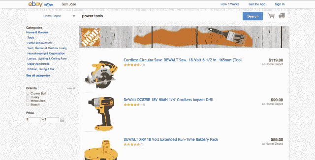
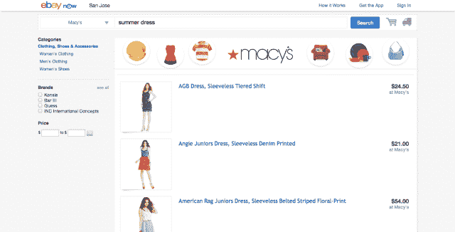

# 易贝将易贝当天送达服务引入桌面，准备区域扩张 

> 原文：<https://web.archive.org/web/https://techcrunch.com/2013/07/22/ebay-brings-same-day-delivery-service-ebay-now-to-desktop-prepares-regional-expansions/>

[易贝现在](https://web.archive.org/web/20221205233514/https://now.ebay.com/)，一年前首次为旧金山居民[推出的当天送达服务](https://web.archive.org/web/20221205233514/https://beta.techcrunch.com/2012/08/05/ebay-is-launching-a-same-day-shipping-service-called-ebay-now/)，在进一步扩展到圣何塞和纽约之前，正准备再次扩大其服务，增加对湾区半岛、布鲁克林和皇后区以及今年夏天晚些时候芝加哥和达拉斯的支持，[如之前报道的](https://web.archive.org/web/20221205233514/https://beta.techcrunch.com/2013/03/28/game-on-google-ebay-now-same-day-delivery-service-expands-to-chicago-and-dallas/)。此外，该公司今天推出了一个电脑版的易贝现在桌面。

据易贝移动和本地副总裁 Dane Glasgow 称，该公司选择将之前专注于移动的易贝 Now 交付服务带到桌面上，因为那些通过网络和移动访问易贝的人是该公司最有价值的客户。他说，在特定的一周内，21%的易贝访客来自多种设备——一台电脑和一台移动设备——但它们占易贝商品总量的 44%。

随着易贝现在出现在桌面上，以前感觉像是一个利基工具的东西现在看起来更像是一个成熟的电子商务网站。在专门的主页上，用户可以浏览和搜索附近商店的产品，以及查看产品信息，包括描述、定价、评级和评论，就像他们直接在零售商的网站上购物一样。

Glasgow 告诉我们，易贝现在得到了“数百”商家的支持，但该公司拒绝提供确切的数字。然而，它确实与几家知名零售商有关系，例如家得宝、塔吉特、梅西百货、GNC、沃尔格林、百思买、玩具反斗城、欧迪办公、Urban Outfitters、RadioShack 和 AutoZone。

这些和其他商家使他们的库存可用于支持送货区的易贝购物者，然后他们可以在不到一小时内收到该商品(最低订单为 25 美元)并支付 5 美元的送货费。格拉斯哥表示，到目前为止，虽然该服务在最后一刻或紧急情况下有一些使用——比如修理坏了的自行车的零件，或者开会急需的东西——但用户也在订购各种你可能不会在一小时送货服务中看到的物品，比如纽约炎热公寓的空调、iPads、电视、消费品、家居和花园用品以及服装。

在新的桌面网站上下单后，易贝 Now 用户还可以看到他们的快递员是谁以及如何联系他们，以防他们在购买后需要分享信息。他们可以在网站上使用信用卡、借记卡或易贝旗下的 PayPal 结账。而且这项服务会将顾客最近的几个送货地址记录在案，这样他们就不用每次购物都重新填表了。

目前，易贝作为 eBay.com 选项的补充运行良好，该选项允许在线购物者在当地商店购买他们不急需的商品。然而，格拉斯哥表示，该计划将很快推出介于一小时送货和店内参观之间的服务水平。今年夏天晚些时候，易贝现在将推出一项新功能，让购物者选择他们的送货窗口。“这是客户要求最高的功能之一，”Glasgow 指出。“这对工作的专业人士来说太棒了，他们可以选择在一天结束时在办公室甚至在家里将订单交付给他们，”他解释道。

这个功能也表明，易贝已经开始解决像这样的服务需要如何工作背后的一些后勤问题，尽管该公司还需要一段时间才能大规模完善这一点，或者让这项服务盈利。易贝没有讨论它目前可能与参与商户达成的收入分成协议，称该计划仍处于试点阶段，盈利能力仍是重点。

然而，格拉斯哥补充说，“我们市场中现有的连接买家和卖家的(商业)模式是相关的，无论交付是否是等式的一部分。”

如今，易贝是众多专注于当日送达的电子商务网站之一。包括沃尔玛、T2、谷歌和 T4 的亚马逊在内的其他公司也一直在这一领域进行实验——后者最近扩展了亚马逊的在线杂货服务。像 [TaskRabbit](https://web.archive.org/web/20221205233514/https://www.taskrabbit.com/) 、 [Postmates](https://web.archive.org/web/20221205233514/http://postmates.com/) 等初创公司也在迎合按需定制的趋势。

易贝认为自己在这个新市场中的定位是成为现在签约易贝的零售商的合作伙伴，而不是竞争对手。但这并不意味着它将成为这些企业当天工作的专属场所。除了现在支持易贝，它的许多商家，包括 Target，Walgreens，Toys R Us 和 Office Depot，仅举几例，也通过加入谷歌的购物快递服务来对冲他们的赌注。

对易贝来说，这意味着它必须做更多的事情，让使用该服务的整个体验能够一次又一次地吸引顾客。定期交付、跨平台支持和扩展的服务领域是有助于实现这一目标的功能。但归根结底，亚马逊在这方面有优势，即使它迄今为止相对安静，甚至不重视它在这一领域的努力。有一种感觉，在某个地方，有一只鞋就要掉下来了，这就是为什么像易贝这样的企业现在一定要吸引人们对易贝这样的早期项目的兴趣——否则就太晚了。

*更新帖子以反映易贝现在比之前预期的更早开始在湾区和纽约进行扩张——也就是今天，2013 年 7 月 22 日*