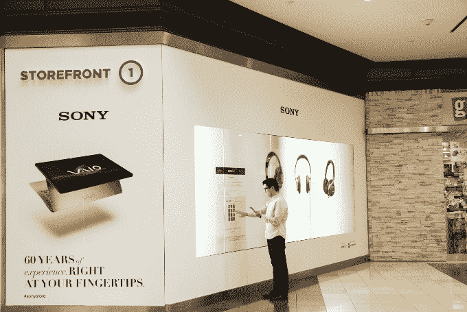

# 易贝在三藩市为索尼、Toms 和 Rebecca Minkoff 推出可购物触摸屏和数字店面 TechCrunch

> 原文：<https://web.archive.org/web/https://techcrunch.com/2013/11/20/ebay-debuts-shoppable-touchscreens-and-digital-storefronts-for-sony-toms-and-rebecca-minkoff-in-san-francisco/>

今天，易贝将在旧金山 Westfield Mall 为购物者推出一系列新的互联数字店面。与市场巨头在纽约的[购物窗口类似，](https://web.archive.org/web/20221209001026/https://beta.techcrunch.com/2013/06/05/ebay-to-make-true-window-shopping-a-reality-with-new-nyc-virtual-retail-stores/)这一新的合作伙伴关系融合了联网眼镜、移动技术和数字支付，让索尼、TOMS 和丽贝卡·明科夫的购物者能够在 Westfield San Francisco Centre 的这些数字店面中购物。

有兴趣购买或浏览这些店面的购物者可以触摸玻璃，从索尼、TOMS 鞋或时装设计师丽贝卡·明科夫的一百件商品中进行选择。如果他们选择购买任何商品，他们可以通过将订单推送到手机上来进行结账。

购物者可以在玻璃上输入他们的电话号码，然后收到一条短信，在手机上完成支付。他们将被发送一个短代码网址，可以用贝宝或信用卡/借记卡支付。购物者可以安排免费送货上门，或者在购物中心的索尼画廊购买索尼商品。

【T2

对易贝来说，这是将其零售技术带入线下体验的一种方式。正如首席执行官约翰·多纳霍今年早些时候告诉我们的那样，易贝希望更接近零售商仍在进行大部分交易的地方，线下和店内。

这些店面将于 11 月 20 日至 1 月 12 日设立，代表了易贝可能实现这一目标的互动方式，并收集关于店内购物行为等令人信服的数据。今年早些时候，易贝[和凯特·斯派德](https://web.archive.org/web/20221209001026/https://beta.techcrunch.com/2013/06/14/ebay-gets-physical-with-a-street-side-sales-kiosk-for-kate-spade/)在纽约测试了一个类似的项目。

几年前，易贝团队与玩具反斗城(Toys 'R' Us)合作，增加了一个店内触摸屏作为搜索栏和过滤礼物搜索器，这两个功能都导致了库存产品的搜索结果页面，按畅销商品排序。然后它给用户一张地图，用户可以使用二维码将地图从屏幕推送到手机上，包括优惠券。

安装在 Westfield 购物中心的新连接玻璃屏幕有两层膜，一层投射高清图像，另一层将前面的玻璃变成触摸屏。玻璃可以厚达一英寸，如果需要的话，可以安装更多的永久性装置。这些屏幕还提供感应扬声器技术来发出声音，旨在给你一种类似于通过智能手机购物的感觉。

更重要的是，这些屏幕让易贝和零售商能够收集与购物体验相关的指标。这些屏幕实际上可以监控 15 英尺外的购物者，以便跟踪有多少人经过屏幕，有多少人停下来购物，以及其他数据点。

参与发布的零售商还将获得参与度指标和购物者点击屏幕所采取的行动等信息，当然，除此之外还有销售数据。与此同时，我们被告知，易贝正在利用一种混合商业模式帮助其努力货币化。在这种新模式下，当购物者点击一件商品时，易贝就可以获得一笔费用，而且，和易贝的传统模式一样，一旦购物者完成购买，这也是基于成功的。

目前还不清楚这些店面最终是否会吸引店内顾客并转化为实际销售。但有了触摸屏，易贝至少可以测量和跟踪顾客是否在与店面互动。如果他们是，并且购买，这可能是易贝在线下世界展示其存在的一种新方式。