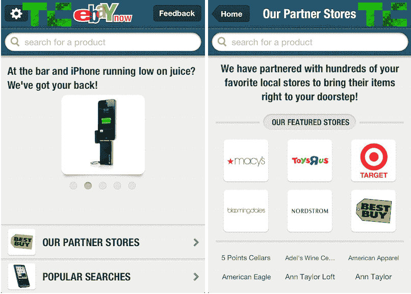
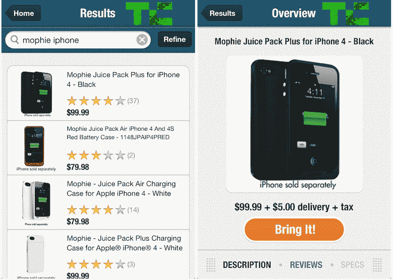

# 易贝推出了一项名为易贝 Now TechCrunch 的当日送达服务

> 原文：<https://web.archive.org/web/https://techcrunch.com/2012/08/05/ebay-is-launching-a-same-day-shipping-service-called-ebay-now/>

易贝今天邀请了一些三藩市的用户参加一项名为[易贝现在](https://web.archive.org/web/20221005212950/https://now.ebay.com/)的新的当日送达服务。作为一款 iOS 应用，易贝 Now 的测试版将让旧金山居民在当地商店购买产品时获得 5 美元的当天运费。它现在为用户注册一个“独家测试版”。任何人都可以注册，被录取的人应该很快就会得到一个下载链接。

像 TaskRabbit 和优步这样的初创公司让消费者尝到了即时满足的滋味，现在易贝似乎也想提供同样的满足感。我们正在见证便利科技的崛起。

拉克什·阿格拉瓦尔[今早在推特上发布了](https://web.archive.org/web/20221005212950/https://twitter.com/rakeshlobster/status/232173991492722688)被邀请去易贝的消息。它只适用于超过 25 美元的购买，但测试版测试人员可以从他们的第一个易贝 Now 订单中获得 15 美元，外加前三个订单的免费送货费，然后收取 5 美元的送货费。

[更新:我从易贝得到了更多的细节。[你现在可以从](https://web.archive.org/web/20221005212950/http://www.ebay.com/local)其 [Milo 平台](https://web.archive.org/web/20221005212950/https://beta.techcrunch.com/2010/12/02/confirmed-ebay-acquires-milo-for-75-million-investors-make-a-killing/)上的任何一家商店购买易贝，这项服务对旧金山居民开放，周一至周五上午 9 点到晚上 9 点，周日上午 9 点到下午 6 点，送货可以在短短一个小时内到达，但商店必须在下单后至少半小时营业。合作商店包括梅西百货、玩具反斗城、塔吉特百货和百思买。被邀请的人将在一般注册之前优先获得访问权。最后，易贝将评估用户兴趣，以确定产品更新以及是否现在进一步推出易贝。]

以下是那些被邀请参加测试的人收到的电子邮件，不过你可以在这里[注册，以便在易贝](https://web.archive.org/web/20221005212950/https://now.ebay.com/signup)准备好之后立即获得它:

*你好【姓名】，*

我们知道你喜欢在易贝购物。但有时你就是等不及发货。听起来熟悉吗？

如果是这样，我们创造了一种令人兴奋的新购物方式。从今天开始，购买 25 美元或以上，旧金山的购物者可以从当地商店订购产品，并让他们送货上门——在家里，在工作场所，或在旧金山的任何其他地方。这项新服务名为“现在易贝”,你可以在这里为你的 iPhone、iPad 或 iPod touch 下载。

由于易贝现在处于测试阶段，我们将从您的第一个订单中扣除 15 美元，并为您的前三个订单提供免费送货！之后，测试期内的每次送货只需 5 美元。您的订单很快就会到达—通常在一个小时之内！很方便，是吧？

*[立即下载 app](https://web.archive.org/web/20221005212950/http://rover.ebay.com/rover/4/0/8?eecl=1&eesi=US&i=18118513700II17fffII1522ceII18136ea6979&eepc=&bu=44283920686&segname=B0458FA-00&crd=20120730185144&emParams=i&sojTags=emid%3Dbu%2Csegname%3Dsegname%2Ccrd%3Dcrd)试用。喜欢就分享吧！*
*你有三份亲朋好友的邀请。*

*购物愉快！*

*易贝现在的团队*

易贝现在可以与亚马逊正面交锋，据说亚马逊正在主要城市规划仓库，提供自己的当天送达服务。这可能会缩短[亚马逊 Prime](https://web.archive.org/web/20221005212950/http://www.amazon.com/gp/prime) 用户的等待时间，他们以每年 79 美元的价格订阅，可以获得免费的两天送达和 3.99 美元的次日送达。然而，亚马逊的首席财务官 Tom Szkutak [在该公司的](https://web.archive.org/web/20221005212950/http://www.theverge.com/2012/7/26/3191615/amazon-cfo-no-same-day-delivery) [Q2 收益电话会议](https://web.archive.org/web/20221005212950/https://beta.techcrunch.com/2012/07/26/amazon-q2-2012/)上说“我们看不到一种在经济上大规模实现当日送达的方式”。

对于亚马逊来说，执行当天服务所需的配送网络可能会非常昂贵，对于装备较差的易贝来说更是如此。无法提供可靠或负担得起的服务可能是对资源的巨大浪费。Szkutak 的评论确实开启了像易贝一样在大城市提供当天服务的可能性，这肯定比在分散的农村地区更容易。

易贝现在也将不得不接受更灵活的创业公司，如[post mates Get Now](https://web.archive.org/web/20221005212950/https://beta.techcrunch.com/2012/05/17/postmates-debuts-get-it-now-on-demand-courier-service-to-the-public/)和 [Y Combinator 的全新 Instacart](https://web.archive.org/web/20221005212950/https://beta.techcrunch.com/2012/08/01/instacart/) 、one-hour(！)外卖食品、杂货和其他商店购买商品的送货服务。

他们肯定对顾客有吸引力。如果我在一个被实体店包围的大城市，想要立即得到某样东西，除非有超快速的运输选择，否则为什么要通过电子商务等上好几天呢？是的，所以你永远不用离开你的洞穴。但是易贝现在可以在几个小时后将你最短暂的冲动转化为产品送到你的门前。

