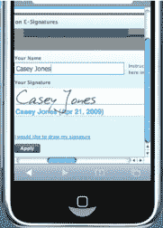
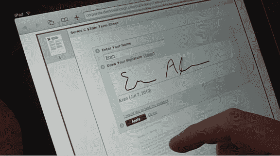

# EchoSign 现在支持 HTML5，在 iPad 上首次推出电子签名 TechCrunch

> 原文：<https://web.archive.org/web/https://techcrunch.com/2010/07/15/echosign-now-supports-html5-debuts-e-signatures-on-the-ipad/>

# EchoSign 现在支持 HTML5，在 iPad 上首次推出电子签名

基于网络的电子签名和签名自动化服务 EchoSign 今天也加入了 HTML5 的行列，推出了对其电子签名平台的全面支持，可在 iPad 和 iPhone 上运行。EchoSign 的电子签名服务让您可以将数字签名附加到合同和其他商业文档中，以数字形式存储它们，并管理这些文档，而无需将其打印出来或传真出去

虽然 EchoSign 的桌面应用程序是基于 Flash 的，但其移动网站现在将支持 HTML5。对于 EchoSign 来说，转向 HTML5 是一个更大的移动战略的一部分，以鼓励更多的用户使用他们的移动设备进行电子签名。事实上，几乎 10%的 EchoSign 用户在移动设备上签署合同。像 iPad 这样的平板设备是查看和签署文件的理想选择。iPad 在企业中的巨大成功推动 EchoSign 将移动签名推向了一个新的高度。

EchoSign 的新版本还可以直接从移动 Safari 和 Chrome 上获得手写的生物特征签名。以前，移动设备上仅完全支持打字签名和合成签名。

EchoSign，[于 2006 年在](https://web.archive.org/web/20221225211318/http://techcrunch.com/2006/01/02/echosign-solves-signature-page-woes/)推出，已经拥有[120 万](https://web.archive.org/web/20221225211318/http://techcrunch.com/2009/09/18/echosign-reaches-one-million-users/)用户，并在一个月内帮助签署和完成了价值超过 3 亿美元的合同。企业客户包括戴尔、谷歌、时代华纳和高通。

迄今为止，EchoSign 已经筹集了 850 万美元的资金。这家初创公司面临来自 DocuSign 和 VeriSign 的竞争。

【YouTube = http://www . YouTube . com/watch？v=iDGzrK935LA&hl=en_US&fs=1]