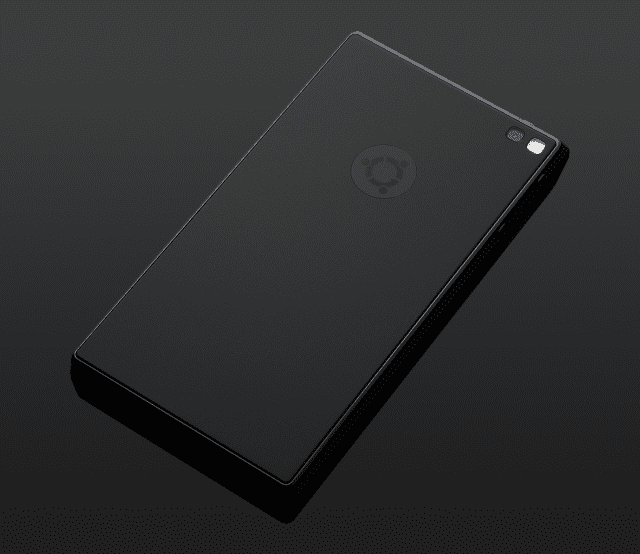

# Ubuntu Edge 智能手机未能实现 3200 万美元的众筹目标

> 原文：<https://web.archive.org/web/http://techcrunch.com/2013/08/22/edge-crowdfunding-fail/>

# Ubuntu Edge 智能手机未能实现 3200 万美元的众筹目标

试图通过众筹筹集 3200 万美元总是显得过于雄心勃勃。事实证明确实如此。Canonical 的 Ubuntu Edge [Indiegogo](https://web.archive.org/web/20230319212314/http://www.indiegogo.com/projects/ubuntu-edge?new=true) 活动[旨在打造一款为融合计算而设计的智能手机](https://web.archive.org/web/20230319212314/https://techcrunch.com/2013/07/22/ubuntu-smartphone-canonical/)远未达到其目标，最终固定资金项目一无所获——当你得到价值约 1200 万美元的承诺时，这肯定会受到伤害。这场运动从 7 月 22 日持续到 8 月 21 日。

Edge 承诺将既是一款高端 Android 和/或 Ubuntu 智能手机，也是一款 Ubuntu 台式机的替代品，但看起来它永远不会攀登自己的众筹珠穆朗玛峰，因为 Canonical 被迫不断想出新的技巧来试图吸引更多的支持者。该设备的[价格下调](https://web.archive.org/web/20230319212314/https://techcrunch.com/2013/08/08/ubuntu-edge-price-drops-to-695-canonical-now-needs-even-more-backers/)，从 830 美元降至 695 美元，此外[增加了额外的价格层级](https://web.archive.org/web/20230319212314/https://techcrunch.com/2013/07/24/ubuntu-edge-smartphone-gets-a-pledge-price-drop-to-keep-the-money-rolling-in-for-that-32m-funding-goal/)。如果项目达到目标，它甚至为投资者提供了投票决定下一个型号规格的能力。这听起来像是一个不错的胡萝卜——但不是 3200 万美元的胡萝卜。

迄今为止，通过众筹筹集的最大金额仍然是 Pebble 智能手表(通过 Kickstarter)筹集的 1020 万美元——这个项目的目标要小得多，为 10 万美元。如果 Canonical 选择了一个更适中的融资目标，它现在也可能获得数百万美元。尽管如此，制造高端智能手机的成本当然远远高于制造 Pebble 这样的智能手机配件——正如 Canonical 指出的:

> 我们设定这么高的众筹目标是有充分理由的。在设计、认证和制造之间，制造一部新手机的成本是巨大的——但我们生产得越多，每部手机的最终成本就越低。设定如此雄心勃勃的目标意味着每台设备的价格更具竞争力。
> 
> 这都是规模的问题。为了以有竞争力的价格提供最终产品，我们需要生产足够的数量来降低单位成本。与此同时，我们希望选择尚未经过数百万单位生产验证的零件。这是我们找到的平衡。较低的筹资目标似乎更有可能成功，但个人补贴金额必须高得多。我们相信这个资金目标和这些津贴水平给了我们最大的成功机会。

结果，Canonical 筹集到了他们过于雄心勃勃的筹资目标的三分之一多一点，并产生了大量的宣传尝试。这可能最终是这场运动的主要目的。我们已经联系了该公司，询问他们在 Indiegogo 未融资后的计划，并将根据任何回应更新这个故事。他们的项目页面还提到:“如果我们达不到目标，那么我们将只专注于商用手机，不会有 Ubuntu Edge。所有捐款将全额退还。”

**更新:**在接受[卫报](https://web.archive.org/web/20230319212314/http://www.theguardian.com/technology/2013/aug/22/ubuntu-edge-founder-failure-canonical)采访时，Canonical 创始人马克·舒托沃尔斯似乎证实了高端“超级手机”概念的穷途末路，但他告诉该报，运营商和手机制造商对开发运行 Ubuntu Mobile 的低端手机感兴趣。

Edge 获得了大约 27，500 名公开上市的支持者，其中包括[彭博承诺为 100 台 Edge 设备](https://web.archive.org/web/20230319212314/https://techcrunch.com/2013/08/07/ubuntu-edge-gets-its-first-major-corporate-backer-in-bloomberg-but-funding-still-off-needed-pace/)提供 8 万美元，这是顶级企业承诺级别的唯一支持者。

该项目提出了一些有趣的问题，即众筹资助复杂硬件项目的局限性。许多更普通的硬件项目在众筹平台上表现很好，但显然在 Canonical 希望筹集的数百万美元之外有一个融资的最佳点(这表明埃隆·马斯克可能不应该试图众筹一个[、60 亿美元的 Hyperloop](https://web.archive.org/web/20230319212314/https://techcrunch.com/2013/08/12/elon-musks-hyperloop-explained-a-technically-possible-sci-fi-dream-hes-to-busy-to-work-on-right-now/) )。在边缘融资层面，投资者/风投的支持似乎是唯一的选择。