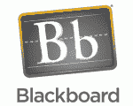

# 有教养的买？Providence Equity Partners 将以 16.4 亿美元现金收购 Blackboard 

> 原文：<https://web.archive.org/web/http://techcrunch.com/2011/07/05/educated-buy-providence-equity-partners-to-acquire-blackboard-for-1-64-billion-in-cash/>

 [Blackboard](https://web.archive.org/web/20230203035433/http://www.blackboard.com/) ，一家为企业和学校开发学习和教育软件的公司，[周五](https://web.archive.org/web/20230203035433/http://www.blackboard.com/About-Bb/Media-Center/Press-Releases.aspx?releaseid=1581633)宣布被一群投资者收购，这些投资者由 [Providence Equity Partners](https://web.archive.org/web/20230203035433/http://www.crunchbase.com/financial-organization/providence-equity-partners) 领导，这是一家专注于媒体、娱乐、通信和信息投资的私募股权公司。普罗维登斯还投资了几家盈利性教育公司，如教育管理公司和群岛学习公司。此次收购是一项价值 16.4 亿美元的全现金交易，普罗维登斯承担了大约 1.3 亿美元的 Blackboard 债务。

2004 年在纳斯达克上市的教育软件巨头，作为收购的结果，将向其股东拥有的每股普通股派发 45.00 美元的现金。根据 Blackboard 的新闻稿，该公司一直在“评估其当前轨迹的战略替代方案”，以努力为其股东提供更好的价值(比他们迄今为止可能获得的价值更好)。

自从 3 月份潜在收购的传言开始蔓延，该公司更广泛地宣布正在寻找潜在买家，Blackboard 的股票基本上徘徊在每股 40 美元以上。(与 4 月 18 日每股 37.16 美元的定价相比，过去几年的平均价格超过 35 美元，收购时每股 45.00 美元对股东来说确实是相对积极的投资回报。)

根据 Blackboard 的新闻稿，该交易必须获得大多数股东的批准，并受到其他成交条件和监管机构的批准，但该交易预计将在 2011 年第四季度完成。一旦交易完成，Blackboard 将恢复为一家私人控股公司。Blackboard 表示，其总部仍将位于华盛顿，并将继续由其高级管理团队领导；然而，当一家公司被一家私人股本集团收购，并重新成为一家私人公司时，变化可能就在前方。

虽然公告没有具体提到成本或人员裁减，但这些往往是这种收购的固有部分，因此 Blackboard 可能会在未来一年进行一点调整，或者至少进行一些精简和调整。

虽然 Blackboard 的产品肯定被广泛使用，有超过 5000 家教育机构使用该公司的软件，但 Blackboard 并不总是在学生中享有最好的声誉，尤其是在用户体验方面。事实上，正是因为这个原因，我的大学选择了自己的定制教育软件。

然而，由于 Blackboard 在市场上领先一步，并且已经在大学和中学教育系统中完全站稳脚跟，也因为它的用户体验还有改进的空间，许多教育初创公司纷纷推出自己的模式，旨在抢夺 Blackboard 的一些市场份额，例如 [CourseKit](https://web.archive.org/web/20230203035433/https://techcrunch.com/2011/06/27/coursekit-1-million-seed/) 、 [Instructure](https://web.archive.org/web/20230203035433/https://techcrunch.com/2011/01/31/instructure-blackboard-universities-coates/) 、 [Nixty](https://web.archive.org/web/20230203035433/https://techcrunch.com/2010/09/02/everfi-raises-11-million-for-financial-literacy-education-application/) 等等。

Blackboard 在今年 1 月以 5300 万美元收购了[主席团](https://web.archive.org/web/20230203035433/http://www.crunchbase.com/company/presidium)，并在 2010 年 3 月以 3300 万美元收购了[Saf-T-Net](https://web.archive.org/web/20230203035433/https://techcrunch.com/2010/03/08/blackboard-buys-mobile-messaging-company-saf-t-net-for-33-million/)。

更多信息，请点击查看 Blackboard 的公告[。](https://web.archive.org/web/20230203035433/http://www.blackboard.com/About-Bb/Company.aspx)