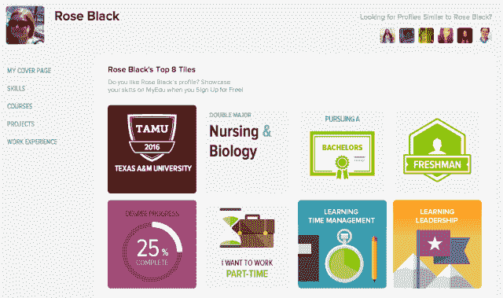
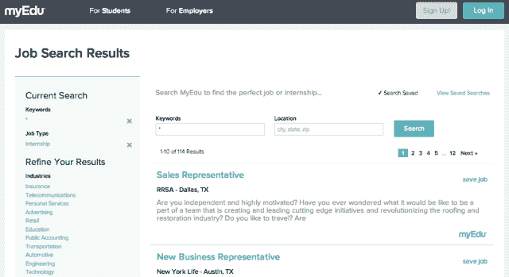

# 教育巨头 Blackboard 收购 MyEdu，以帮助更新其品牌并重振其用户体验 

> 原文：<https://web.archive.org/web/https://techcrunch.com/2014/01/16/education-giant-blackboard-buys-myedu-to-help-refresh-its-brand-and-reanimate-its-user-experience/>

多年来， [Blackboard](https://web.archive.org/web/20221208025721/http://www.blackboard.com/) 已经成为教育界最熟悉的品牌之一。今天，Blackboard 的学习管理系统(LMS)和教育工具在美国 75%的学院和大学以及超过一半的 K-12 区得到使用。在 20，000 个组织中拥有超过 2，000 万用户，这家有 16 年历史的公司仍然是市场上的主导者，为专业和学术部门提供服务。

然而，尽管 Blackboard 长期占据主导地位，但它并不总是能激发赞美之歌。学习管理系统旨在成为生产力软件之类的实用工具，专注于效率，解决管理员和教师的工作流程和组织难题。但对于大学生来说，Blackboard 的用户体验和笨拙的界面已经成为学术生活中臭名昭著的一部分，是要忍受的，而不是享受的。

经过多年的起伏，创始人的离开，品牌形象的下降，以及从私营公司到上市公司再到私营公司的转变，该公司正显示出准备进行改革的迹象，特别是其核心产品:LMS。首先是本周的新闻，它已经收购了 [MyEdu](https://web.archive.org/web/20221208025721/https://www.myedu.com/) ，这是一家成立三年的初创公司，也是一个旨在帮助学生降低大学教育成本、规划学位和找工作的平台的制造商。

交易的条款没有披露，但我们知道，随着 MyEdu 及其 20 名员工加入 Blackboard 的行列，这家初创公司将继续在奥斯汀的总部工作。就收购对最终用户的影响而言？据 MyEdu 首席产品官弗兰克·莱曼(Frank Lyman)称，除了其职业平台的逐步扩展，对当前用户的影响将是最小的，该平台将仍然免费供任何人注册。

自 2009 年成立以来，MyEdu 已经开发了一个平台，在三个关键领域为学生提供价值，所有这些都围绕着一个核心目标，即帮助年轻人以提高他们获得工作机会的方式管理他们的学术生涯。

从一开始，MyEdu 就有条不紊地收集学生和大学的数据，试图找出导致高成本的模式。它不仅提供评分信息和汇总教授评论，还努力收集详细的公共课程数据，以使学生更容易知道哪个教授教哪个班，以及这些课程在哪个教室开设。

最重要的是，MyEdu 提供了允许学生创建在线文件夹的工具，就像以学生为中心的 LinkedIn 一样，他们可以在那里展示他们的技能，展示课程作业和教授推荐等等。支持其学位规划资源的是其职业工具，这是 MyEdu 的第三个重点领域，旨在帮助学生找到实习机会，并使雇主更容易与学生联系并招募顶级人才。

今天，[在近 2000 万美元的外部资金](https://web.archive.org/web/20221208025721/https://beta.techcrunch.com/2012/10/10/with-20m-raised-myedu-launches-new-tools-to-help-college-students-actually-connect-with-employers/)的帮助下，MyEdu 的平台现在提供来自全国 800 多家机构的数据，超过 100 万名学生使用 MyEdu 来帮助管理他们的大学经历并与雇主联系——其中 66 万名学生在过去 14 个月中创建了帐户。反过来，莱曼表示，超过 20 万名学生在该平台上公开了他们的个人资料，他认为这证明了学生对以大学为中心的数字作品集和简历平台的需求。

正是在这里，Blackboard 从收购 MyEdu 的学位管理和职业规划平台中获益最大。尤其是教育平台和学习管理技术，正因用户体验的消费化而迅速转变，在产品开发方面，越来越多地开始将学生视为消费者。

通过收购 MyEdu，Blackboard 现在可以访问一个学生档案网络，鼓励用户像 LinkedIn 一样写“背书”,而不是简单地互相评分，以及职业规划功能，这些功能共同帮助该公司加强学校与外部生活之间的桥梁。传统上，Blackboard 一直在努力解决两者之间的差异，并在自己的产品组合中有效地集成新技术。

MyEdu 将是 Blackboard 的第一个重大考验。该公司迫切需要改善用户体验，增加产品之间以及界面和体验之间的连续性。为此，随着 Blackboard 寻求重新关注未来的产品设计，MyEdu 的关键卖点之一似乎是其用户友好的设计和 UX。

在接受《Inside Higher Ed》采访时，Blackboard 首席执行官说,“在设计领域，MyEdu 是我见过的最好的设计之一。你无法量化酷，但它是一款非常酷的产品。”

随着越来越多精通数字技术的学生伴随着脸书和社交网络成长，LMS 正在发生变化——不仅是其产品的“消费化”,也是一种不仅专注于更好的分享，而且更好地将大学校园与外部生活联系起来的实用工具。Blackboard 可能拥有用户和大部分市场份额，但它没有一个“酷”的产品。幸运的话，收购 MyEdu 预示着向这个方向迈出了一小步。毕竟，如果你不能从内部制造酷，而你有钱，为什么不买一些呢？

更多信息，请点击此处查看 [Blackboard 的公告。](https://web.archive.org/web/20221208025721/http://www.blackboard.com/About-Bb/News-Center/Press-Releases.aspx?releaseid=122712)