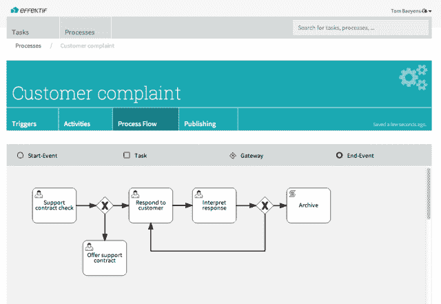

# Effektif 通过面向企业| TechCrunch 的 IFTTT 式服务将工作流引入云

> 原文：<https://web.archive.org/web/http://techcrunch.com/2014/01/14/effektif-brings-workflows-to-the-cloud-with-an-ifttt-like-service-for-the-enterprise/>

[effect if](https://web.archive.org/web/20230314225115/http://www.effektif.com/)希望为企业做 [IFTTT](https://web.archive.org/web/20230314225115/http://www.ifttt.com/) [为消费者网络所做的事情](https://web.archive.org/web/20230314225115/https://techcrunch.com/2012/12/20/iftt-raises-7m-from-andreessen-horowitz-for-connector-service/)——通过基于云的服务自动化工作流程，但该服务旨在与业务级工具和流程集成，如 Salesforce、Oracle、Google Drive、Box 等。创始人兼首席执行官汤姆·贝恩斯(Tom Baeyens)解释说，今天推出的解决方案旨在帮助团队围绕共享任务进行协调，他说这个想法是受 IFTTT 和专注于企业的 Zapier 等面向消费者的服务的启发。

Baeyens 自己已经开发 BPM(业务流程管理)系统十年了，之前曾创建过 jBPM(被 JBoss 收购，现在是 RedHat)和 Alfresco 的 Actviti 等开源项目。

借鉴其他创业公司用基于云的软件即服务替代方案取代内部企业系统的做法，Baeyens 开始设想“为我们其余人”提供 BPM 服务——即任何人都可以在几分钟内自动化和使用的服务，即使没有技术倾向。

这个想法变成了今天的 effect if，这家公司在 2013 年 3 月获得了€120 万英镑的投资，开始运营。这笔资金来自柏林和总部位于森尼维尔的 Signavio，这是一家成立于 2009 年的快速增长、盈利的 BPM 提供商，已经在致力于将流程建模转移到云。

“他们投资是因为他们想要一个合作伙伴来执行他们的流程模型，”Baeyens 说。“还因为他们对简化工作流程有着共同的愿景，而且他们相信公司本身。”

为了解释服务如何工作，创始人提供了一个用例示例。“Effektif 会做这样的事情:‘当一封电子邮件到达这个地址时，首先为杰克创建一个任务列表，以便上传一个文档。完成后，将文档上传到 Google Drive，并创建一个新任务，由支持团队的人来完成，”他说。

在发布时，该团队已经构建了用于协作的共享任务列表和一个将简单列表视图与图形流程相结合的流程构建器。(这是基于 [BPMN](https://web.archive.org/web/20230314225115/http://en.wikipedia.org/wiki/BPMN) ，看起来类似流程图的行业标准)。Baeyens 告诉我们，涉及用户任务协调的部分即将完成，与 Drive、Box 和 Salesforce 的集成将在几周内完成。

该计划是免费提供核心产品——协作共享任务列表，同时通过向需要更高级集成的用户收费来创收。付费的“团队工作流”版本将支持涉及云服务的基本工作流，而高端的“企业流程管理”版本将包括内部集成功能和分析。

如今，除了位于比利时的 Baeyens 之外，该公司还有两名全职开发人员、一名兼职设计师和营销人员。但 Signavio 的两位首席执行官 Gero Decker 和 Torben Schreiter 也参与其中，在产品和其他业务方面指导较小的团队。“他们在没有外部投资的情况下，在四年时间里从 0 到 40 名员工建立了 Signavio 的良好记录，”Baeyens 指出。

Effektif 显然是一个比 IFTTT 更复杂的产品，if TTT在 2012 年末从安德森·霍洛维茨、NEA 和其他人那里筹集了 700 万美元，但两家公司都在相同的领域运营，着眼于现有的 50 亿美元 BPM 和工作流市场。

IFTTT 的计划是首先扩大消费者基础，然后扩展到企业，而 Effektif 完全跳过了构建消费者产品。然而，对 IFTTT 有利的是，这意味着当他们到达企业时，他们将更好地了解真实的人是如何使用软件的，如果这一切成为现实的话。与此同时，Effektif 得到了已经在企业领域运作的更大组织的支持。

这项新服务今天就可以使用了，在它的主页上注册[。](https://web.archive.org/web/20230314225115/http://www.effektif.com/)