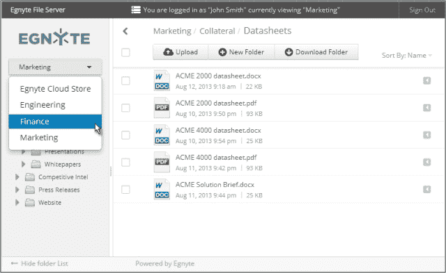

# Egnyte 展示了全新的外观，并增加了共享最敏感文件的安全性 TechCrunch

> 原文：<https://web.archive.org/web/https://techcrunch.com/2013/09/25/egnyte-adds-security-to-try-and-outrival-box-and-other-file-storage-providers-but-awareness-is-a-question-mark/>

# Egnyte 展示了新的外观，并增加了共享最敏感文件的安全性

Egnyte 有了一个新的外观和一个新的平台，允许客户共享最敏感的文档，这些文档在历史上是文件共享和存储服务无法安全管理的。

新的 Storage Connect 虚拟设备将内部文件映射到跨一个或多个站点的云访问层。数据平面位于防火墙之后，而控制平面位于云中。这听起来很复杂，但本质上意味着数据是安全的，除非管理员授予权限，否则不允许客户访问文件。客户使用 Storage Connect 作为虚拟集线器，而不是通过虚拟专用网络(VPN)进行访问。

用户可以从任何移动设备、浏览器或桌面环境访问该文件。如果客户对这些文件拥有“写入”权限，他们就可以进行编辑。加密取决于操作系统。管理员控制是否允许用户“离线访问”,即使允许，文件也是安全的。

相比之下，文件共享服务盒现在有了[的 CipherCloud](https://web.archive.org/web/20230214215135/https://techcrunch.com/2012/12/05/cipher-cloud-raises-30m-from-andreessen-horowitz-for-cloud-encryption-technology/ "CipherCloud Raises $30M From Andreessen Horowitz For Cloud Encryption Technology") ，通过[的 AES 256 位加密](https://web.archive.org/web/20230214215135/http://en.wikipedia.org/wiki/Advanced_Encryption_Standard)来保护云的数据和应用。CipherCloud 将其技术扩展到 Box，提供使用加密密钥的能力，这些密钥由客户保留，由授权用户在个人电脑或移动设备上访问和解密。 使用 CipherCloud，文件仍然需要在盒子云中，这违反了不同 客户 和行业的一些合规性要求，其中 数据 需要在他们的控制下，而不仅仅是使用 密钥 。

Box 创始人兼首席执行官 Aaron Levie 在昨晚的电话采访中表示，其融合安全性和简单性的能力是其主要优势。该公司已经部署了数万名用户。它拥有迪士尼和宝洁等客户。列维说，公司仍在努力满足特定行业的监管要求。他指出，该公司是首批允许医疗保健信息在云中使用的公司之一。就如何处理文件而言，大多数公司将云用作中介层，将桌面上的 Word 文件与 Box 服务同步。

Egnyte 正在利用其新的存储连接技术进行深度安全保护。但要真正成为游戏中的一员，它必须从盒子剧本中吸取一页。在李维成为著名的首席执行官之前，该公司专注于建立合作伙伴关系，这使其能够接触到广泛的客户网络。Okta、Jive Software、Cipher Cloud 和其他数十家合作伙伴帮助 Box 拓展了业务，帮助 Levie 证明了他的公司有能力从微软这样的公司赢得业务。

为了提升自己的形象，该公司开始了新一轮的形象改造。它有一个新的标志，并改变了它的用户界面，使其更加现代和平易近人。

Egnyte 拥有为企业量身打造的技术。它具有安全性，允许客户在其企业环境中使用 [Google Drive](https://web.archive.org/web/20230214215135/https://techcrunch.com/2013/07/18/the-google-drive-paradox-and-why-egnyte-is-not-complaining/ "The Google Drive Paradox And Why Egnyte Is Not Complaining") 。这是一个好故事，但下一步是扩大它的范围，成为一个更受认可的公司，拥有一个可以帮助它扩大基础的生态系统。Box 有动量，Dropbox 也是。Egnyte 的客户群与这两家公司不同，但无论如何，它都需要一个更广泛的战略，才能成为一个强大的市场参与者。