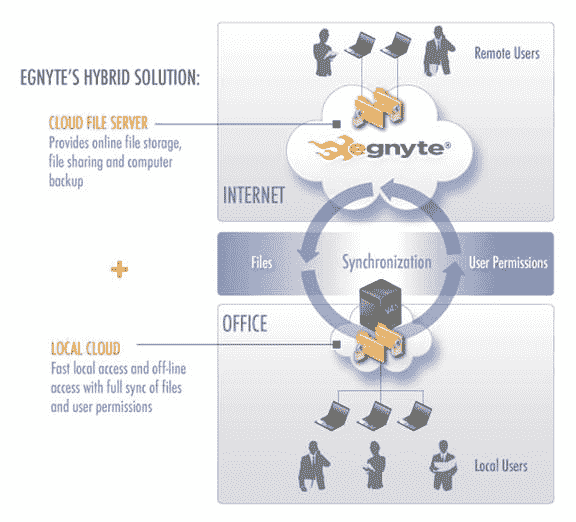

# Egnyte 现在帮助企业同步超过 50 亿个文件 TechCrunch

> 原文：<https://web.archive.org/web/http://techcrunch.com/2010/12/21/egnyte-now-helping-businesses-sync-over-5-billion-files/>

我们之前没有提到文件存储和同步服务 [Egnyte](https://web.archive.org/web/20230203061230/http://www.egnyte.com/) ，但它从 2008 年就已经出现了，现在正在与超过 50 万个用户许可证同步大约 50 亿个文件。换句话说，有相当多的人在用。

Egnyte 可以被描述为一种类似 Dropbox 的服务，主要致力于帮助中小型企业同步文件。但它并不完全基于云。相反，它使用了一种所谓的混合解决方案，即企业将一个连接到办公室电脑的网络存储设备作为“本地云”，所有文件都在这个本地的网络连接硬件上进行同步和备份。因为这些文件在现场可用，所以访问它们不需要互联网访问，并且延迟被最小化。这些本地云可以由 Netgear ReadyNAS 设备或基于 VMware 的虚拟设备组成。

但同样，这个“本地云”NAS 也连接到 Egnyte 的服务器上，客户端计算机和 NAS 上的文件之间的任何更改也会同步到 web 上，以便远程访问。一旦这些文件进入云中，公司管理员就可以在员工之间以及业务合作伙伴之间实现文件共享，业务合作伙伴可以被授予对特定文件的受限访问权限。这个云部分也可以作为远程备份，文件可以从 MAC、Windows 和手机上访问。

那么，为什么一个企业要用它而不是其他同步应用呢？首席执行官 Vineet Jain 解释说，当你有一个七八名员工的团队，所有必要的文件都可以在每个人的电脑上复制，而不会遇到存储限制，那么像 Dropbox 和 Sugarsync 这样的解决方案就很好。但他说，当涉及到管理 50 人或数百人的存储时，这可能会变得难以为继，这就是 Egnyte 的用武之地。

Jain 说，该公司从第一天起就专注于中小企业，Egynte 正在吸引越来越多的大客户。Egynte 过去看到每个客户的平均订单规模约为 6 个席位，现在，在过去的两个季度中，这个数字正朝着每个客户超过 25 个席位的方向发展。他还说，在过去的七个月里，每月的经常性收入逐月增长了 20%。

Egnyte 成立于 2006 年，已经筹集了超过 600 万美元的资金，包括 2009 年 7 月 Maples Investments 和 Polaris Venture Partners 的 A 轮融资。

值得注意的是，Dropbox 最近为团队推出了 [Dropbox，这使得它更适合一个主帐户下的多个用户，其 1.0 版本包括选择性同步(你不再需要将所有同步的目录复制到所有链接的计算机)。但至少在这一点上，Egnyte 的服务似乎更直接地迎合了大型企业的需求。此外还有面向企业的](https://web.archive.org/web/20230203061230/https://www.dropbox.com/teams)[Sugarsync](https://web.archive.org/web/20230203061230/https://techcrunch.com/2009/11/03/sugarsync-sweetens-file-syncing-for-small-businesses/)和面向企业的[Syncplicity](https://web.archive.org/web/20230203061230/https://techcrunch.com/2009/11/09/syncplicity-launches-business-edition-for-data-storage-in-the-cloud/)，但这些都没有使用与 Egnyte 相同的混合存储模型。
